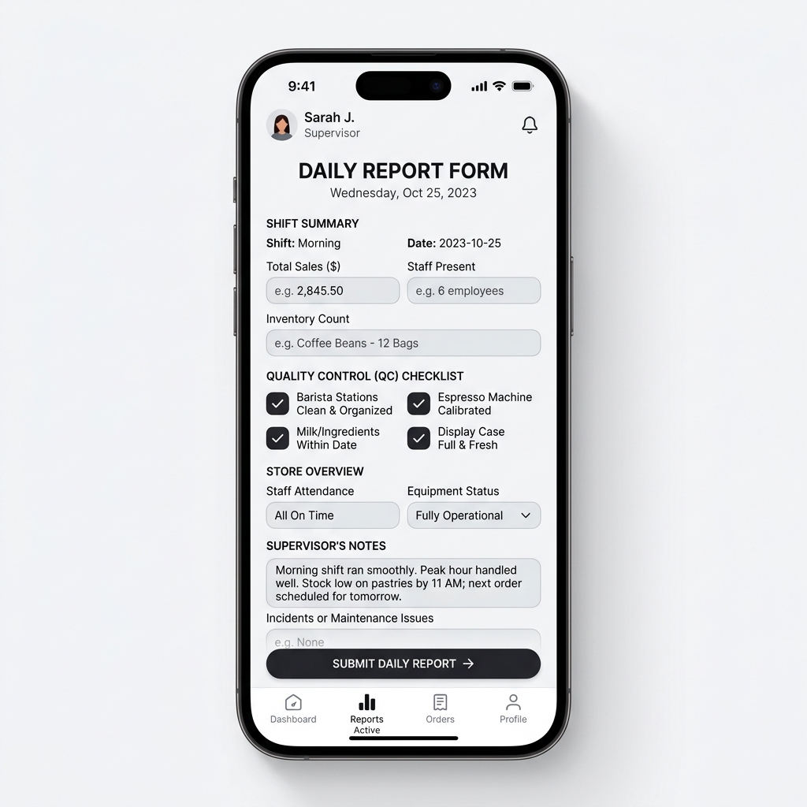
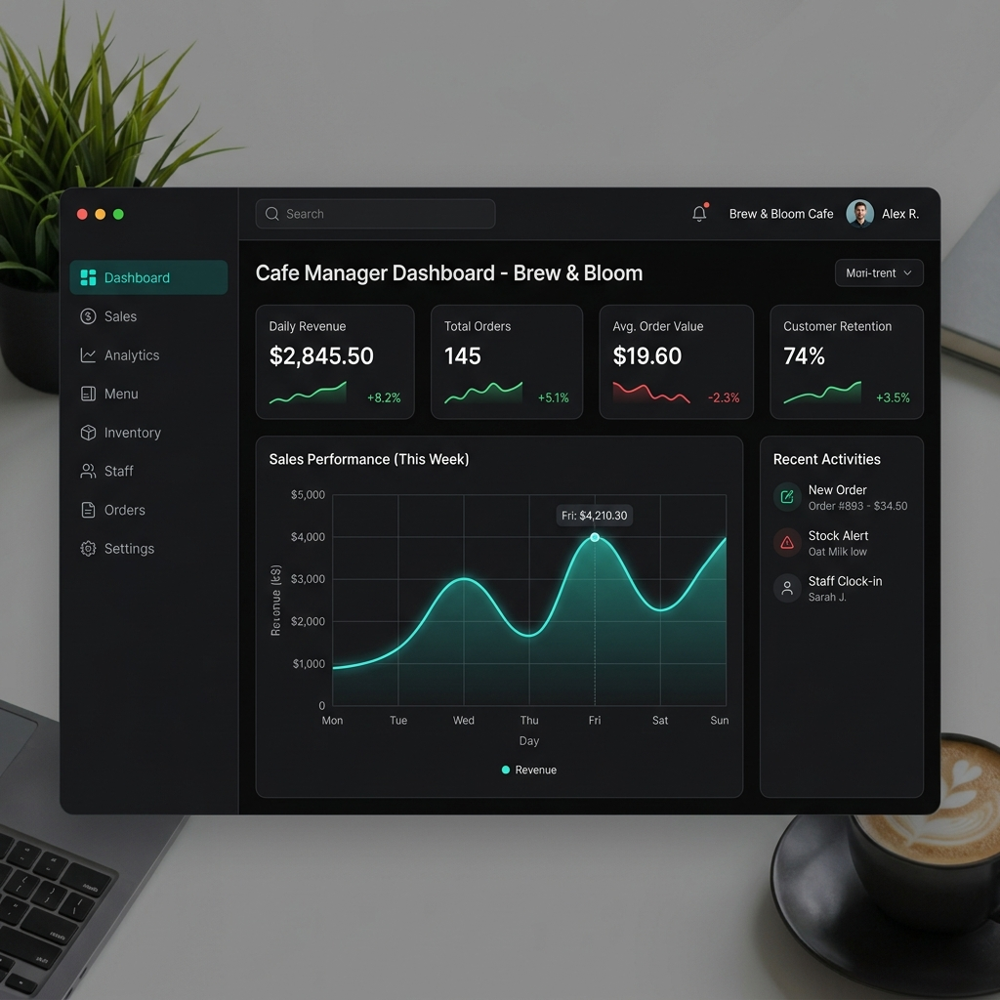
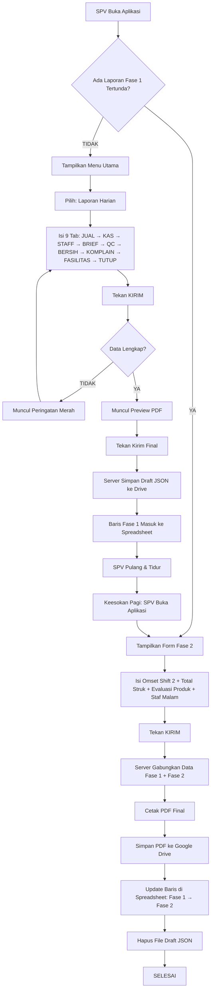
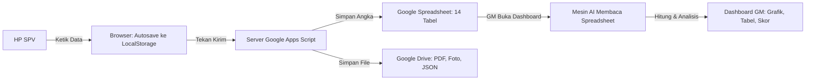
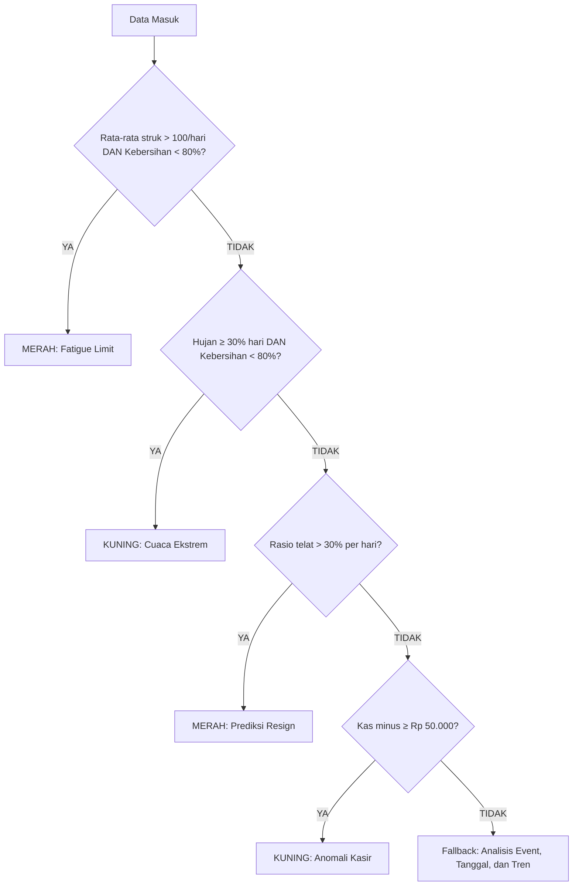

# ZERO CAFE APP v2.0
## Buku Panduan Pengguna & Spesifikasi Teknis Komprehensif

**Dikembangkan oleh:** Acronimous Studio
**Disusun untuk:** Pemilik (Owner), General Manager & Supervisor Zero Cafe
**Versi Dokumen:** 2.1 — Checkpoint 20
**Tanggal Rilis:** Juli 2026

---

## DAFTAR ISI

**BAGIAN I — PENGANTAR**
- BAB 1: Apa Itu Zero Cafe App & Kenapa Dibuat
- BAB 2: Cara Masuk (Login) & Navigasi

**BAGIAN II — PANDUAN SUPERVISOR (SPV)**
- BAB 3: Laporan Harian (9 Tab + Fase 2)
- BAB 4: Laporan Mingguan
- BAB 5: Laporan Bulanan
- BAB 6: Pengaturan & Master Data

**BAGIAN III — PANDUAN GENERAL MANAGER (GM / OWNER)**
- BAB 7: Dashboard Tab 1 — Keuangan & Ringkasan KPI
- BAB 8: Dashboard Tab 2 — Operasional & Layanan
- BAB 9: Dashboard Tab 3 — SDM & Evaluasi

**BAGIAN IV — DI BALIK LAYAR (ARSITEKTUR & FORMULA)**
- BAB 10: Mesin Analisis — Parameter, Threshold & Formula
- BAB 11: Arsitektur Data — Database & Penyimpanan File
- BAB 12: Diagram Alur Kerja (Visual)
- BAB 13: Sistem Keamanan & Perlindungan Data

**BAGIAN V — BANTUAN**
- BAB 14: FAQ & Troubleshooting (Pertanyaan Umum)

---

# BAGIAN I — PENGANTAR

---

## BAB 1: APA ITU ZERO CAFE APP & KENAPA DIBUAT

### 1.1 Latar Belakang

Zero Cafe App adalah aplikasi pelaporan operasional harian yang dibangun secara khusus oleh **Acronimous Studio** untuk Zero Cafe. Aplikasi ini bukan aplikasi kasir (POS), bukan aplikasi stok, dan bukan aplikasi akuntansi. Fungsi utamanya adalah **menjadi mata dan telinga pemilik (owner) di outlet yang tidak bisa dikunjungi setiap hari**.

Melalui aplikasi ini:
- **Supervisor (SPV)** melaporkan kondisi lapangan secara terstruktur setiap hari.
- **General Manager (GM/Owner)** memantau kesehatan bisnis melalui Dashboard yang menampilkan angka-angka kunci secara otomatis.

### 1.2 Filosofi: Data-Driven Disciplinary

Setiap data yang diketik SPV bukan sekadar formalitas. Angka-angka tersebut dihitung secara otomatis oleh mesin di balik layar untuk menghasilkan **4 Indikator Kunci (KPI)** yang menentukan sehat atau tidaknya operasional kafe:

| No | KPI | Target | Artinya |
|----|-----|--------|---------|
| 1 | **Kepatuhan SOP (Keramahan)** | ≥ 95% | Seberapa sering staf menyapa dan melayani pelanggan dengan ramah |
| 2 | **Rata-rata Penjualan Harian** | Tidak boleh turun dari target bulanan | Omset harian harus konsisten menuju target |
| 3 | **Komplain Pelanggan Serius** | Maksimal 2 per bulan | Lebih dari 2 komplain = alarm merah |
| 4 | **Turnover Barista** | Maksimal 1 orang per 3 bulan | Staf yang keluar terlalu sering = operasional terganggu |

Keempat angka ini muncul di halaman pertama Dashboard GM sebagai **"Ringkasan 4 KPI Utama"** — sehingga owner cukup membuka aplikasi dan dalam 3 detik sudah tahu kondisi kafe.

### 1.3 Mekanisme Dua Fase (Fase 1 & Fase 2)

Karena outlet Zero Cafe beroperasi hingga larut malam (Perintis tutup jam 04:00 dini hari), tidak mungkin menunggu semua data selesai baru mengirim laporan. Oleh karena itu, pelaporan harian dibagi menjadi **dua tahap**:

| Fase | Kapan | Siapa | Isi |
|------|-------|-------|-----|
| **Fase 1 (Malam)** | Saat SPV selesai shift (±21:00) | SPV | 9 Tab inspeksi: Penjualan Shift 1, Kas, Staf, Briefing, QC, Kebersihan, Komplain, Fasilitas, Penutup |
| **Fase 2 (Pagi Besoknya)** | Sebelum jam 13:00 siang keesokan hari | SPV | Omset Shift 2, Total Struk Transaksi, Evaluasi Produk (Top 5 & Bottom 3), Komplain Susulan Malam, Absensi Staf Malam |

**Apa yang terjadi di balik layar?**
Saat SPV menekan tombol "Kirim" di Fase 1, sistem **belum mencetak PDF**. Sistem menyimpan data sementara dalam bentuk file cadangan (Draft JSON) di Google Drive. Keesokan paginya, saat SPV mengirim Fase 2, sistem menggabungkan kedua data, mencetak PDF final, dan menyimpan laporan lengkap ke database.

### 1.4 Jam Operasional Outlet

| Outlet | Buka | Tutup |
|--------|------|-------|
| **Perintis** | 08:00 | 04:00 (dini hari, setiap hari) |
| **Dg Tata** | 08:00 | 24:00 (Minggu–Kamis) / 01:00 (Jumat–Sabtu) |

**Jam Kerja SPV:** 12:00 siang – 21:00 malam (sama untuk kedua outlet).

### 1.5 Batas Waktu Laporan (Streak)

Untuk mendorong kedisiplinan, sistem memiliki fitur **Streak** (rantai keberhasilan):
- **Batas Akhir:** Laporan Fase 2 **wajib dikirim sebelum jam 13:00 (1 siang) keesokan harinya**.
- Jika terlambat melewati batas waktu tersebut, rantai Streak SPV akan **putus**.
- Streak ini terlihat di Dashboard GM sebagai indikator kedisiplinan SPV.

---

## BAB 2: CARA MASUK (LOGIN) & NAVIGASI

### 2.1 Membuka Aplikasi

Aplikasi Zero Cafe dibuka melalui browser HP atau laptop menggunakan link (URL) khusus yang diberikan oleh Acronimous Studio. Tidak perlu mengunduh atau memasang aplikasi dari Play Store/App Store.

### 2.2 Layar Login (Satu Kolom Pintar)

Saat halaman terbuka, Anda hanya akan melihat **satu kotak input di tengah layar**. Tidak ada tombol "SPV" atau "GM" — cukup masukkan kode akses Anda:

| Kode yang Dimasukkan | Hasilnya |
|---|---|
| **`Zero123`** | Masuk sebagai **GM/Owner** → langsung diarahkan ke Dashboard GM |
| **`1234`** | Masuk sebagai **SPV Outlet Perintis** → diarahkan ke Menu Utama SPV |
| **`5678`** | Masuk sebagai **SPV Outlet Dg Tata** → diarahkan ke Menu Utama SPV |

> **Catatan Keamanan:** PIN SPV menentukan outlet mana yang terkunci. Setelah login, SPV **tidak bisa mengubah outlet**. Ini mencegah kesalahan atau manipulasi data antar cabang.

### 2.3 Menu Utama SPV

Setelah login berhasil, SPV akan melihat 4 tombol utama:

1. **Laporan Harian** — Mengisi laporan operasional 9 Tab (atau melanjutkan Fase 2 jika ada yang tertunda)
2. **Laporan Mingguan** — Evaluasi taktis 7 hari
3. **Laporan Bulanan** — Evaluasi strategis 1 bulan penuh
4. **Pengaturan Parameter** — Mengatur target omset, mendaftarkan event, dan mengelola data staf

---

# BAGIAN II — PANDUAN SUPERVISOR (SPV)

> **Catatan untuk SPV:** Bagian ini ditulis khusus untuk Anda. Bahasa yang digunakan bersifat langsung dan praktis — fokus pada "apa yang harus dilakukan" di setiap layar.



---

## BAB 3: LAPORAN HARIAN (9 TAB + FASE 2)

### 3.1 Fitur Penting Sebelum Mulai

Sebelum mengisi laporan, kenali dulu 3 fitur perlindungan data yang bekerja diam-diam di balik layar:

1. **Simpan Otomatis (Autosave):** Setiap huruf yang Anda ketik langsung tersimpan di memori browser HP Anda. Jika aplikasi tertutup mendadak (baterai habis, sinyal putus), data Anda **tidak hilang**. Saat Anda buka kembali, semua isian akan tetap ada.

2. **Perlindungan Anti-Klik Ganda:** Setelah Anda menekan tombol "Kirim", sistem akan menahan semua klik selama 10 detik. Ini mencegah laporan terkirim 2 kali jika Anda tidak sengaja menekan tombol berkali-kali.

3. **Perlindungan Antar-Outlet:** Jika Anda login sebagai SPV Perintis, lalu besok login sebagai SPV Dg Tata (misalnya karena pindah tugas), sistem akan otomatis membuang data lama yang tidak cocok dengan outlet Anda saat ini. Data outlet lain tidak akan pernah tercampur.

### 3.2 Tab 1: JUAL (Penjualan Shift 1 & Konteks)

Tab ini adalah fondasi utama laporan harian. Data di sini menjadi bahan kalkulasi omset, target, dan tren di Dashboard GM.

| Yang Harus Anda Isi | Cara Mengisi | Catatan Penting |
|---|---|---|
| **Nama Supervisor** | Ketik nama Anda, sistem akan memunculkan daftar pilihan otomatis | Hanya nama staf dari outlet Anda yang muncul |
| **Outlet** | Sudah terkunci otomatis (abu-abu), tidak bisa diedit | Ditentukan dari PIN saat login |
| **Tanggal Laporan** | Pilih tanggal dari kalender | Setelah memilih tanggal, **tunggu sebentar** — sistem sedang menarik angka target omset dari database |
| **Jam Masuk** | Pilih jam Anda tiba di outlet | Digunakan untuk menghitung ketepatan waktu |
| **Cuaca Dominan** | Pilih salah satu: Cerah/Panas, Mendung, Hujan Gerimis, Hujan Badai | Digunakan mesin AI untuk menganalisis pengaruh cuaca terhadap penjualan |
| **Profil Pengunjung** | Pilih tipe pengunjung yang paling dominan hari ini | Digunakan untuk strategi pemasaran |
| **Target Omset (Rp)** | **Tidak perlu diisi** — angka muncul otomatis | Diambil dari target yang Anda atur di Pengaturan Parameter |
| **Omset Shift 1 (Rp)** | Ketik angka penjualan Shift 1 | Saat diketik, bar hijau di bawah akan bergerak menunjukkan persentase pencapaian |
| **Omset Shift 2** | Tidak bisa diisi sekarang (abu-abu) | Diisi besok pagi di Fase 2 |

### 3.3 Tab 2: KAS (Audit Uang di Laci Kasir)

Tab ini merekam hasil penghitungan uang fisik di laci kasir. Anda bisa mengaudit lebih dari sekali dalam satu shift.

| Yang Harus Anda Isi | Cara Mengisi | Catatan Penting |
|---|---|---|
| **Modal Awal Kasir** | Ketik jumlah uang receh standar saat buka (umumnya Rp 200.000) | — |
| **Jam Audit** | Pilih jam saat Anda menghitung uang | — |
| **Total QRIS** | Ketik total uang masuk via QRIS | — |
| **Total Tunai** | Ketik total uang tunai fisik di laci (belum dikurangi modal awal) | — |
| **Aktual (Sistem)** | Ketik angka total penjualan menurut mesin kasir (POS) | Ini adalah angka "kebenaran" yang jadi pembanding |
| **Selisih (Rp)** | Ketik hasil selisih antara uang fisik dan data sistem | Jika minus, angka akan berwarna **merah** — ini yang dipantau GM |
| **Catatan Selisih** | Jelaskan kenapa ada selisih (jika ada) | **Sangat penting!** Tanpa penjelasan, GM bisa salah mengira ini sebagai kecurangan |

**Tombol penting:**
- **Tombol "TAMBAH" (kanan atas):** Tekan jika Anda mengaudit laci kasir lebih dari sekali (misal: siang dan malam).
- **Tombol "HAPUS" (merah, di setiap baris):** Hapus baris audit tertentu jika salah tekan.

### 3.4 Tab 3: STAFF (Absensi & Kepatuhan SOP)

Tab ini adalah salah satu yang paling berpengaruh terhadap KPI di Dashboard GM. Setiap pilihan yang Anda buat di sini akan langsung mempengaruhi skor kedisiplinan staf.

**Langkah mengisi:**
1. Pilih nama staf dari dropdown **"PILIH STAFF"**
2. Tekan tombol **"TAMBAH"** untuk menambahkan ke daftar evaluasi
3. Isi penilaian untuk setiap staf yang sudah ditambahkan

**Tombol khusus:**
- **+ STAFF BARU:** Untuk mendaftarkan staf freelance/cabutan yang belum ada di database
- **+ PINJAM STAF:** Untuk mengambil nama staf dari outlet lain (jika ada pertukaran shift)

| Yang Harus Anda Isi | Pilihan | Dampak ke Dashboard GM |
|---|---|---|
| **Metode Penilaian** | Dinilai Langsung / Dinilai via Absensi | — |
| **Status Kehadiran** | Hadir, Terlambat, Izin, Sakit, Alpha | Memilih "Terlambat" **langsung menurunkan** persentase kedisiplinan staf di Dashboard GM |
| **Keramahan Terlewat?** | Ya (Miss) / Tidak (Aman) | Memilih "Ya (Miss)" **langsung menurunkan** skor SOP Keramahan. Tidak muncul untuk posisi Kitchen |
| **Catatan Khusus** | Teks bebas | Jelaskan alasan keterlambatan atau pelanggaran |

### 3.5 Tab 4: BRIEF (Evaluasi Shift & Briefing)

Tab ini berisi analisis kualitatif Anda sebagai SPV. Kata-kata yang Anda ketik di sini akan dibaca oleh mesin *Text Mining* di Dashboard GM.

| Yang Harus Anda Isi | Contoh |
|---|---|
| **Target Hari Ini** | "Capai 120 struk, fokus upselling dessert" |
| **Fokus Perilaku** | "Ingatkan tim untuk senyum dan tawarkan add-on" |
| **Masalah Shift Kemarin** | "Kulkas kurang dingin, es batu cepat cair" |
| **Solusi Disepakati** | "Sudah panggil teknisi, sementara pakai es dari luar" |

### 3.6 Tab 5: QC (Quality Control Produk)

Dibagi menjadi dua bagian:

**A. QC Espresso (Wajib diisi setiap hari)**

| Yang Harus Anda Isi | Pilihan |
|---|---|
| **Jam Kalibrasi** | Jam berapa grinder/espresso machine ditarik |
| **Kondisi** | Baik/Standar, Pahit/Bitter, Asam/Sour, Watery |
| **Keterangan Adjust** | Contoh: "Ubah grind size jadi 2.5, ekstraksi terlalu cepat" |

**B. QC Menu Lainnya (Tekan "TAMBAH ITEM" untuk menambah)**

| Yang Harus Anda Isi | Cara Mengisi |
|---|---|
| **Jam** | Jam pengecekan |
| **Kategori & Produk** | Pilih Minuman/Makanan/Snack, lalu ketuk input produk untuk mencari nama menu |
| **Status Temuan** | Pilihan berubah sesuai kategori (misal: Makanan → "Tidak Fresh"; Minuman → "Layering Salah") |
| **Catatan Tindakan** | Langkah koreksi yang diambil |

### 3.7 Tab 6: BERSIH (Inspeksi Kebersihan 8 Area)

Tab ini mewajibkan Anda menginspeksi **8 area kafe** satu per satu: Kaca, Lantai, Tembok, Toilet, Wastafel, Parking Area, Bar, Musholah.

Setiap area berbentuk kotak lipatan (Accordion) yang harus Anda buka dan isi:

| Yang Harus Anda Isi | Pilihan | Dampak |
|---|---|---|
| **Status Kebersihan** | Bersih, Cukup Bersih, Kotor | Rata-rata dari 8 area ini membentuk **Skor Kebersihan (Hygiene Score)** di Dashboard GM |
| **Skor** | Otomatis terisi (Bersih=100, Cukup=70, Kotor=40), tapi Anda bisa ubah manual | Misal: area "Cukup Bersih" tapi hampir sempurna, Anda boleh ubah jadi 85 |
| **Centang Alasan** | Kotak-kotak centang yang muncul otomatis sesuai area dan status | Cukup centang, tidak perlu mengetik — menghemat waktu Anda |

> **Kenapa menggunakan centang, bukan ketik?**
> Fitur centang sengaja dipilih agar Anda lebih cepat selesai. Pilihan-pilihan yang tersedia diambil dari **catatan laporan fisik Zero Cafe sebelumnya** — jadi semua pilihan memang relevan dengan kondisi nyata di lapangan.

**Apa yang terjadi dengan data kebersihan ini?**
Selain disimpan ke database utama, sistem juga otomatis **mencetak PDF Checklist Kebersihan Harian** yang tersimpan permanen di Google Drive sebagai bukti fisik.

### 3.8 Tab 7: KOMPLAIN (Laporan Keluhan Pelanggan)

Gunakan tombol **"TAMBAH"** untuk menambah baris insiden (bisa diulang tanpa batas). Gunakan tombol **"HAPUS"** untuk menghapus baris jika salah.

**Bagian Atas — Statistik:**

| Yang Harus Anda Isi | Catatan |
|---|---|
| **Total Kasus Komplain** | Angka total komplain hari ini |
| **Total Remake** | Jumlah produk yang harus dibikin ulang |
| **Analisis Remake ≥3** | Kotak peringatan merah ini **hanya muncul** jika Total Remake 3 atau lebih. Anda wajib jelaskan kenapa banyak gagal |

**Bagian Bawah — Detail Per Komplain:**

| Yang Harus Anda Isi | Contoh |
|---|---|
| **Jam & Inisial Pelanggan** | "14:30" dan "Bpk. A" |
| **Isi Komplain** | "Matcha terlalu manis" |
| **Tindakan (Respon)** | "Minta maaf, dibuatkan ulang yang baru" |
| **Checkbox Remake/Eskalasi** | Centang "Remake" jika produk dibikin ulang. Centang "Eskalasi GM" jika butuh perhatian owner |

### 3.9 Tab 8: FASILITAS & BAHAN

Tab ini merekam kerusakan alat dan kebutuhan belanja bahan habis pakai. Gunakan tombol **"TAMBAH"** dan **"HAPUS"** sesuai kebutuhan.

**A. Fasilitas & Alat (Kerusakan)**

| Yang Harus Anda Isi | Catatan |
|---|---|
| **Nama Alat/Fasilitas** | Contoh: "AC Lantai 1", "Grinder" |
| **Status Kerusakan** | Rusak Ringan / Rusak Sedang / Rusak Berat (Mati) |
| **Eskalasi GM?** | Tekan kotak merah jika butuh perbaikan cepat dari owner |
| **Keterangan Singkat** | Contoh: "Bocor freon, air menetes" |
| **Tombol Unggah Foto** | Ambil/lampirkan foto bukti kerusakan. Setelah unggah, berubah jadi "Lihat Foto" & "Hapus Foto" |

**B. Bahan & ATK Habis**

| Yang Harus Anda Isi | Catatan |
|---|---|
| **Nama Bahan** | Contoh: "Sabun Cuci", "Tisu" |
| **Status Ketersediaan** | Contoh: "Habis", "Sisa 1 Botol" |
| **Estimasi Harga (Rp)** | Perkiraan biaya untuk reimburse |
| **Tombol Unggah Bukti** | Foto nota belanja atau kondisi barang yang kosong |

> **Penyimpanan Foto Otomatis:**
> Semua foto yang Anda unggah akan otomatis tersortir ke folder yang benar di Google Drive:
> - Foto kerusakan alat → masuk folder **`Fasilitas`**
> - Foto nota belanja/bahan → masuk folder **`Pengeluaran`**
>
> Nama file juga otomatis diganti menjadi format cerdas, contoh: `18-07-ACLantai1-RusakBerat.jpg` — sehingga GM mudah mencari di kemudian hari.

### 3.10 Tab 9: TUTUP (Kesimpulan & Pengiriman)

Ini adalah tab terakhir sebelum laporan dikirim.

| Yang Harus Anda Isi | Catatan |
|---|---|
| **Kendala Utama Hari Ini** | Ringkasan kesulitan paling mengganggu selama shift |
| **Rekomendasi / Saran** | Permintaan ke manajemen atau solusi strategis dari Anda |

**Dua Tombol di Bawah:**

| Tombol | Fungsi |
|---|---|
| **BATAL** | Kembali ke Menu Utama. Data yang sudah diketik **tidak hilang** (tersimpan otomatis) |
| **KIRIM LAPORAN SOP** | Mengirim laporan ke server |

**Apa yang terjadi saat Anda tekan "KIRIM"?**
1. **Jika ada data yang belum lengkap:** Muncul peringatan merah yang menyebutkan bagian mana yang belum diisi. Laporan **ditolak** sampai Anda melengkapinya.
2. **Jika semua data lengkap:** Muncul jendela **Pratinjau (Preview)** besar yang menampilkan tampilan PDF laporan Anda. Periksa sekali lagi, lalu tekan **"Kirim Final"** di dalam jendela tersebut.

### 3.11 Fase 2 (Penyelesaian Keesokan Pagi)

Saat Anda membuka aplikasi keesokan harinya, jika ada Laporan Harian yang tertunda (Fase 1 sudah terkirim tapi Fase 2 belum), sistem akan otomatis menampilkan formulir Fase 2.

**A. Data Keuangan Malam:**

| Yang Harus Anda Isi | Catatan |
|---|---|
| **Omset Shift 2 (Rp)** | Penjualan shift malam. Otomatis dijumlahkan dengan Shift 1 untuk membentuk **Total Omset Harian** |
| **Total Struk Transaksi** | Jumlah total struk hari itu (Shift 1 + Shift 2). Angka ini digunakan mesin AI untuk menghitung **Rata-rata Belanja per Pelanggan (ATS)** |

**B. Evaluasi Produk:**

Untuk setiap kategori (Minuman, Makanan, Snack):

| Yang Harus Anda Isi | Catatan |
|---|---|
| **Top 5 Produk** | 5 menu paling laris hari itu |
| **Bottom 3 Produk** | 3 menu paling tidak laku |
| **Alasan Bottom 3** | Kenapa produk ini tidak laku (Contoh: "Bahan habis", "Tidak ada promo") |

**C. Operasional Malam:**

| Yang Harus Anda Isi | Catatan |
|---|---|
| **Komplain Susulan (Malam)** | Jika ada insiden malam, tambahkan di sini (sama dengan Tab 7) |
| **Absensi & SOP Staf Malam** | Evaluasi kehadiran dan keramahan staf closing (sama dengan Tab 3) |

> **Perlindungan Data Usang:**
> Jika besok Anda membuka aplikasi dan ternyata server sudah tidak punya catatan Fase 1 yang tertunda (misalnya karena sudah diproses atau dibatalkan), tapi HP Anda masih menyimpan sisa data kemarin, sistem akan otomatis **membuang data usang tersebut**. Ini mencegah data hari kemarin tercampur dengan hari ini.

---

## BAB 4: LAPORAN MINGGUAN (EVALUASI TAKTIS)

Laporan Mingguan diisi **sekali setiap minggu** dan berfungsi sebagai evaluasi taktis. Untuk meringankan beban Anda, **sebagian besar data kuantitatif ditarik secara otomatis** dari laporan harian.

### 4.1 Tab 1: Identitas, Rekap Omset & Evaluasi Produk

**Langkah Pertama:** Pilih **Rentang Waktu** (Dari Tanggal sampai Tanggal).

> **Peraturan 7 Hari:**
> Sistem mengunci pilihan rentang waktu agar **tepat 7 hari** (misal: Senin sampai Minggu). Jika Anda memilih kurang atau lebih dari 7 hari, akan muncul **peringatan merah** yang memblokir proses selanjutnya.

Setelah rentang valid, sistem menarik data otomatis:

| Apa yang Muncul Otomatis | Penjelasan |
|---|---|
| **Tabel Rekap Omset (7 Hari)** | Anda **tidak perlu mengetik** — tabel ini terisi otomatis dengan data Target & Omset per hari |
| **Total Target & Aktual** | Penjumlahan otomatis 7 hari |
| **Bar Indikator (Warna)** | Hijau (≥100%), Oranye (80-99%), Merah (<80%) |
| **Evaluasi Produk (Minuman, Makanan, Snack)** | Top 5 dan Bottom 3 per kategori — ditarik otomatis dari laporan harian Anda |

| Yang Harus Anda Isi Sendiri | Catatan |
|---|---|
| **Rencana Tindakan (Action Plan)** | Satu-satunya kolom yang harus diketik. Tulis strategi Anda untuk minggu depan berdasarkan data yang sudah tersaji |

### 4.2 Tab 2: Komplain & Evaluasi Performa Staf

**A. Komplain & Kendala Mingguan:**

| Yang Harus Anda Isi | Catatan |
|---|---|
| **Total Kasus Komplain** | Isi sendiri (bukan otomatis — agar Anda sadar menghitung) |
| **Total Remake** | Angka berwarna merah (setiap remake = kerugian bahan baku) |
| **Penyebab Utama Komplain** | Sengaja teks bebas — Anda harus menyimpulkan akar masalah |
| **Kendala Utama Berulang** | Masalah yang terus muncul selama 7 hari |

**B. Evaluasi Performa Staf:**

Sistem akan menampilkan daftar nama staf outlet Anda. Setiap nama berbentuk kotak lipatan (Accordion):

| Yang Harus Anda Isi | Pilihan | Dampak |
|---|---|---|
| **Status Penilaian** | **Berkembang** (ada inisiatif, belajar cepat), **Stagnan** (sekadar selesai, zona nyaman), **Menurun** (sering telat, lambat) | Data ini menjadi pondasi GM untuk keputusan gaji, bonus, atau SP |
| **Keterangan (Kendala & Planning)** | Wajib dirincikan: apa kemajuan/kendalanya, dan rencana pelatihan minggu depan | Contoh: "Sudah lancar kasir. Planning: minggu depan ajarkan kalibrasi grinder" |

### 4.3 Tab 3: Rencana Perbaikan Tim & Pengiriman

| Yang Harus Anda Isi | Catatan |
|---|---|
| **Rencana Perbaikan Tim** | Tindakan nyata yang akan Anda lakukan minggu depan |
| **Kebutuhan SPV / Tim** | Alat atau dukungan yang dibutuhkan (Contoh: "Butuh lakban", "Butuh training menu baru") |

Gunakan tombol **"TAMBAH"** untuk menambah baris jika rencana/kebutuhan lebih dari satu.

**Tiga Tombol Bawah:**

| Tombol | Fungsi |
|---|---|
| **SIMPAN DRAFT** | Menyimpan semua isian di memori browser. Bisa dilanjutkan besok |
| **EXPORT PDF** | Mengunduh PDF ke HP Anda sebagai arsip pribadi (tidak mengirim ke server) |
| **TINJAU & KIRIM LAPORAN** | Validasi data → jika lengkap, tampilkan Preview → Kirim Final |

---

## BAB 5: LAPORAN BULANAN (EVALUASI STRATEGIS)

Laporan Bulanan bersifat **strategis** dan menuntut Anda untuk mengevaluasi diri sendiri secara mendalam (Self-Reflection).

### 5.1 Tab 1: Ringkasan & Sales

**A. Identitas & Periode (Bagian Terpenting)**

| Yang Harus Anda Isi | Peringatan |
|---|---|
| **Nama Supervisor** | Nama Anda |
| **Outlet** | Pilih outlet Anda |
| **Bulan Laporan** | **HATI-HATI!** Begitu Anda memilih bulan, sistem langsung menarik semua data harian di bulan tersebut. Jika salah pilih bulan, semua angka di bawahnya akan salah |

**B. Metrik Penjualan (Kotak Hitam)**

Angka-angka ini muncul otomatis dalam desain kotak hitam elegan:

| Yang Muncul Otomatis | Penjelasan |
|---|---|
| **Total Sales Real (Rp)** | Penjumlahan seluruh omset harian di bulan tersebut |
| **Target Sales (Rp)** | Diambil dari target yang Anda atur di Pengaturan Parameter |
| **Persentase Pencapaian** | Contoh: **119%** berarti Anda melebihi target |

**C. Ringkasan Eksekutif (Ketik Sendiri)**

| Yang Harus Anda Isi | Contoh |
|---|---|
| **Pencapaian Utama Bulan Ini** | "Berhasil melampaui target sales hingga 110%" |
| **Masalah / Isu Utama** | "Sering terjadi pemadaman listrik di minggu ke-2" |
| **Kesimpulan Keseluruhan** | Opini Anda mengenai operasional bulan ini |

**D. Evaluasi Produk (4 Accordion: Minuman, Makanan, Snack, Lainnya)**

| Yang Muncul Otomatis | Yang Harus Anda Isi |
|---|---|
| **Top 5 Produk** (tidak bisa diedit) | — |
| **Bottom 3 Produk** (tidak bisa diedit) | **Rencana untuk setiap produk mati:** "Bikin Bundling", "Hapus dari menu", atau "Tingkatkan rasa" |

### 5.2 Tab 2: Staff & Quality Control

**A. Evaluasi Operasional Staf:**

| Yang Muncul Otomatis | Catatan |
|---|---|
| **% Kepatuhan SOP** | Rata-rata dari audit mingguan (tidak bisa diubah) |
| **Total Telat (Kali)** | Berwarna merah tebal. Akumulasi sebulan penuh (tidak bisa diubah) |

| Yang Harus Anda Isi | Catatan |
|---|---|
| **SP / Teguran Keluar** | Berapa kali Anda mengeluarkan Surat Peringatan bulan ini |

**B. Turnover (Karyawan Resign):**

Jika ada staf yang keluar bulan ini:
1. Tekan tombol **"+ Tambah Staf Resign"**
2. Isi nama, alasan, dan tanggal efektif
3. Setiap nama muncul sebagai kartu putih dengan tombol hapus (jika salah input)

> **Sinkronisasi Otomatis:** Saat Anda mengirim laporan bulanan dengan daftar resign, sistem otomatis mengubah status staf tersebut di database utama menjadi "Resign". Anda tidak perlu menghapusnya manual di Pengaturan.

**C. Evaluasi Individu Staf (Sistem Hybrid AI):**

Di bagian ini, sistem memberikan **saran awal** untuk setiap staf berdasarkan rata-rata nilai mingguan:

| Kolom | Cara Kerja |
|---|---|
| **Status Penilaian** | Sudah terisi otomatis oleh sistem (misal: "Stagnan"). Tapi Anda **boleh mengubahnya** jika merasa staf layak nilai lebih baik atau lebih buruk |
| **Catatan / Alasan** | Ruang bagi Anda untuk menulis "rapor akhir" staf tersebut |

**D. Rekap QC & Komplain:**

| Yang Muncul Otomatis | Yang Harus Anda Isi |
|---|---|
| Total Kasus Komplain (sebulan) | — |
| Total Remake Produk (sebulan) | — |
| — | **Evaluasi QC Espresso:** Konsistensi rasa kopi sebulan terakhir |
| — | **QC Produk Lainnya:** Tekan "+ TAMBAH" untuk menambah evaluasi per menu |

### 5.3 Tab 3: Evaluasi & Rencana Strategis

**A. Fasilitas & Inventaris:**

| Yang Harus Anda Isi | Catatan |
|---|---|
| **Total Pengeluaran Perbaikan (Rp)** | Uang yang habis untuk servis alat bulan ini |
| **Kerusakan Belum Selesai** | Laporan alat yang masih rusak dan butuh tindakan |

**B. Strategi Bulan Depan:**

| Yang Harus Anda Isi | Catatan |
|---|---|
| **Fokus & Strategi Utama** | Janji Anda untuk bulan depan |
| **Kebutuhan Supervisor** | Dukungan yang dibutuhkan dari owner |

**C. Evaluasi Mandiri (Paling Pribadi):**

| Yang Harus Anda Isi | Catatan |
|---|---|
| **Pencapaian Terbaik Pribadi** | Apa yang Anda banggakan bulan ini |
| **Tantangan Tersulit** | Pengakuan jujur tentang kelemahan Anda |
| **Skill Yang Ingin Ditingkatkan** | Area kemampuan yang ingin diasah |
| **Rating Kinerja Sendiri (1-10)** | Geser slider untuk merating diri sendiri |

---

## BAB 6: PENGATURAN & MASTER DATA

Halaman ini adalah **ruang kendali administratif** yang wajib Anda kunjungi setiap awal bulan.

### 6.1 Target Omset Bulanan

**Fakta Penting:** Angka target omset **TIDAK di-set oleh owner**. Wewenang ini didelegasikan penuh kepada Anda (SPV). **Jika Anda lupa memasang target, semua persentase pencapaian di aplikasi akan membaca 0%.**

| Kolom | Cara Mengisi |
|---|---|
| **Outlet** | Terkunci otomatis dari PIN login |
| **Bulan & Tahun** | Pilih untuk bulan mana target ini berlaku |
| **Total Target (Rp)** | Ketik angka. Sistem otomatis menambahkan titik ribuan saat Anda mengetik |
| **Tombol SIMPAN TARGET** | Tekan dan tunggu animasi loading selesai |

### 6.2 Kalender Event & Faktor Eksternal

Alat untuk melaporkan kejadian luar biasa yang mempengaruhi trafik pengunjung kepada GM.

| Kolom | Contoh |
|---|---|
| **Kategori Event** | Kalender Akademik (Kampus), Event Lokal / Festival, Lainnya |
| **Nama Event** | "UAS Universitas Hasanuddin" atau "Hujan Badai 3 Hari" |
| **Tanggal Mulai & Selesai** | Pilih dari kalender. Data ini digunakan mesin AI GM untuk menjelaskan naik-turunnya omset |
| **Tombol SIMPAN PARAMETER** | Setelah disimpan, event muncul di daftar bawah. Bisa dihapus kapan saja |

### 6.3 Kelola Staf Outlet

Tombol hitam panjang di bagian bawah layar bertuliskan **"KELOLA STAF OUTLET"**:
- Menambahkan staf baru ke database
- Mengubah status staf menjadi "Resign"
- Perubahan di sini langsung mempengaruhi daftar nama yang muncul saat Anda mengisi laporan kinerja staf

---

# BAGIAN III — PANDUAN GENERAL MANAGER (GM / OWNER)

> **Catatan untuk GM:** Bagian ini ditulis khusus untuk Anda sebagai pemilik. Fokus pada cara membaca dan menginterpretasikan data yang ditampilkan sistem.



---

## BAB 7: DASHBOARD TAB 1 — KEUANGAN & RINGKASAN KPI

Ini adalah layar pertama yang Anda lihat setelah login. Fungsinya: **dalam 10 detik, Anda sudah tahu kondisi kafe**.

### 7.1 Pengaturan Filter (Bagian Atas)

Sebelum data muncul, Anda perlu memilih:

| Filter | Fungsi |
|---|---|
| **Tanggal Mulai & Selesai** | Rentang waktu data yang ingin dilihat |
| **Outlet** | Perintis, Dg Tata, atau Semua |
| **Tombol "Simpan & Tarik Analisis"** | Memerintahkan sistem menarik data dari database |

### 7.2 Mode Waktu Otomatis (Smart Briefing Mode)

Sistem secara cerdas mendeteksi berapa hari rentang waktu yang Anda pilih, dan menyesuaikan gaya analisis:

| Lencana Mode | Rentang | Fokus Analisis |
|---|---|---|
| **MODE OPERASIONAL (Biru)** | ≤ 7 Hari | Evaluasi harian, deteksi anomali cuaca & staf |
| **MODE TAKTIS (Ungu)** | 8 – 95 Hari | Tren mingguan/bulanan, kinerja SPV |
| **MODE STRATEGIS (Ungu Tua)** | > 95 Hari | Strategi makro bisnis, pertumbuhan tahunan. Beberapa modul detail otomatis disembunyikan agar data tidak bising |

### 7.3 AI Summary (Kotak Warna di Bagian Atas)

Kotak ini adalah **kesimpulan eksekutif instan** yang dihasilkan mesin AI. Warna kotak menunjukkan tingkat urgensi:

| Warna | Artinya | Contoh Pesan |
|---|---|---|
| **Hijau** | Semuanya aman | "Momen Emas: Peluang mencetak rekor omset" |
| **Biru** | Normal, tidak ada anomali | "Kinerja stabil tanpa anomali" |
| **Kuning** | Ada peringatan, perlu perhatian | "Trafik padat, daya beli rendah (Event + Tanggal Tua)" |
| **Merah** | Kritis, butuh tindakan segera | "Batas Kelelahan Tim tercapai" atau "Prediksi staf resign mendadak" |

> **Penting:** Pesan AI ini bukan sekadar teks acak. Sistem menjalankan **4 algoritma berbeda** yang memeriksa silang antara omset, kebersihan, cuaca, kehadiran staf, dan event lokal. Penjelasan detail ada di BAB 10.

### 7.4 Total Omset & Target

Kotak hitam elegan yang menampilkan:

| Angka | Sumber Data | Cara Membaca |
|---|---|---|
| **Total Omset (Rp)** | Penjumlahan Omset Shift 1 + Shift 2 dari semua laporan harian | Uang riil yang masuk pada periode yang Anda pilih |
| **Tren MoM (±%)** | Perbandingan dengan bulan lalu | Lencana kecil hijau (naik) atau merah (turun) di sebelah angka omset |
| **Target Omset (Rp) + Bar** | Dari Pengaturan Parameter SPV | Bar hijau bergerak proporsional 0-100% |
| **YTD Trajectory (Rp & %)** | Akumulasi 1 Januari s/d hari ini vs Target Tahunan | Menunjukkan apakah bisnis on-track untuk mencapai target tahun ini. Target tahunan diatur oleh Anda di **Pengaturan GM** |

### 7.5 Metrik Transaksi & Grafik

| Komponen | Sumber Data | Cara Membaca |
|---|---|---|
| **Total Transaksi** | Total struk dari Fase 2 | Jumlah pelanggan yang berhasil dilayani |
| **Average Ticket Size (ATS)** | `Total Omset ÷ Total Transaksi` | Rata-rata belanja per pelanggan. Semakin besar = semakin pintar staf membujuk pelanggan belanja lebih |
| **Trend Line Chart** | Omset per hari (garis waktu) | Lihat di tanggal berapa omset anjlok atau meroket |
| **Day of Week (Bar Chart)** | Rata-rata omset per nama hari (Senin, Selasa, dst.) | **Hari Terlemah** = target promo. **Hari Terkuat** = siapkan staf penuh |

> Di bawah grafik Day of Week, terdapat **Rekomendasi AI** berupa 3 pilar saran otomatis (SDM, Marketing, Maintenance) yang menggunakan nama hari terlemah Anda.

### 7.6 Ringkasan 4 KPI Utama

Empat kotak besar yang menampilkan detak jantung bisnis Anda:

| Kotak | Sumber Data | Kapan Warna Berubah Merah |
|---|---|---|
| **SOP Keramahan** | Rata-rata dari audit SPV harian | Jika < 90% |
| **Target Penjualan** | Omset Aktual vs Target | Jika aktual di bawah target |
| **Komplain Bulanan** | Hitungan form komplain | Jika > 2 komplain sebulan |
| **Turnover Barista** | Form evaluasi bulanan SPV | Jika > 1 staf keluar per kuartal |

Di atas 4 kotak ini terdapat **Skor Operasional (0-100)** dengan label EXCELLENT / GOOD / ATTENTION / CRITICAL. Skor ini dihitung dari formula:

```
Skor Operasional = (Pencapaian Target × 50%) + (Skor Kebersihan × 30%) + (Kepatuhan SOP × 20%)
```

| Skor | Label |
|---|---|
| ≥ 85 | EXCELLENT |
| ≥ 70 | GOOD |
| ≥ 50 | ATTENTION |
| < 50 | CRITICAL |

---

## BAB 8: DASHBOARD TAB 2 — OPERASIONAL & LAYANAN

Tab ini memindahkan fokus Anda dari angka keuangan ke **kondisi fisik kafe dan kualitas pelayanan**.

### 8.1 AI Insight: Kebersihan (Higienisitas)

Kotak ini menampilkan lingkaran persentase skor kebersihan rata-rata, disertai kesimpulan otomatis:

| Kondisi | Pesan AI |
|---|---|
| Omset tembus target, tapi kebersihan < 95% | **"Sales Naik, SOP Turun"** — Tim kelelahan, kebersihan terbengkalai saat ramai |
| Omset gagal, dan kebersihan < 95% | **"Peringatan Ganda"** — Butuh intervensi segera |
| Semua beres (SOP > 95%) | **"The Good Standard"** — Standar terjaga |

### 8.2 Area Kritis (Kebersihan)

Jika ada area kafe yang skornya di bawah 95%, sistem menampilkannya di sini dalam kotak merah menyala:
- Contoh: "1. Toilet (Skor: 90%) — Bersih"
- Anda langsung tahu titik lemah outlet tanpa perlu membaca laporan panjang

### 8.3 Galeri Pengeluaran (Bahan & ATK)

Tampilan geser horizontal (*slider*) yang menampilkan foto nota belanja SPV beserta nama item dan harganya.
- Jika kosong: "Aman. Tidak ada pengeluaran di periode ini"
- Klik foto untuk memperbesar (verifikasi nota, cegah fraud nota fiktif)

### 8.4 Maintenance & Eskalasi Fasilitas

Galeri foto berwarna kemerahan berisi aset yang butuh perbaikan:
- Menampilkan foto kerusakan yang diunggah SPV
- Jika item ditandai "Eskalasi GM" oleh SPV, muncul di sini
- Jumlah tiket eskalasi tertulis di pojok kanan

### 8.5 Statistik Komplain & QC

| Total Komplain | Warna |
|---|---|
| 0 | Hijau (Aman) |
| 1 | Kuning (Waspada) |
| 2 | Oranye (Batas Maksimal) |
| > 2 | **Merah (KPI Dilanggar)** |

---

## BAB 9: DASHBOARD TAB 3 — SDM & EVALUASI

Tab ini menggantikan rutinitas meeting bulanan. Anda bisa langsung melihat siapa SPV yang berkinerja baik dan siapa yang perlu dievaluasi.

> **Catatan:** Beberapa bagian di tab ini otomatis **disembunyikan** jika Anda sedang di Mode Strategis (>95 hari). Ini disengaja agar data tahunan tidak terdistorsi oleh pergantian staf.

### 9.1 Kesehatan Tim & Aset

4 indikator kesehatan tim:

| Indikator | Sumber Data | Catatan |
|---|---|---|
| SOP Keramahan Staf (%) | Rata-rata dari laporan harian | Warna berubah sesuai persentase |
| Total Telat | Hitungan dari database kehadiran | Berubah merah jika sering |
| Teguran (SP) | Dari laporan bulanan SPV | — |
| Turnover | Dari laporan bulanan SPV | — |

### 9.2 Cash Discrepancy Fingerprint (Minus Kas)

> Hanya muncul di Mode Taktis (< 95 hari).

Jika sering terjadi uang kas minus, sistem menghitung **frekuensi kehadiran setiap staf** pada hari-hari saat kas minus terjadi. Hasilnya ditampilkan sebagai grafik batang:
- Jika satu nama menjulang tinggi, itu adalah **indikator potensi evaluasi** (bukan tuduhan langsung — lihat BAB 10 untuk penjelasan algoritma)
- Contoh: "Total Minus Rp 200.000. Terjadi saat Amel bertugas 26 kali, Eko 17 kali"

### 9.3 Revenue Per SPV Shift (Leaderboard)

Menghitung rata-rata omset per shift jaga tiap SPV:
- Membedakan secara nyata mana SPV yang hanya bisa mengatur jadwal, dan mana SPV yang pandai menjual (upselling)

### 9.4 Dominasi Topik Briefing SPV

Sistem menghitung kata kunci yang paling sering muncul di topik briefing SPV:
- Contoh: kata "Bersih" sering disebut, tapi skor kebersihan tetap buruk → **"Eksekusi di lapangan lemah"**

### 9.5 Pandangan Ke Depan & Evaluasi SPV

Berisi isi pikiran SPV dari laporan bulanan mereka:
- **Strategi Bulan Depan** yang direncakanan SPV
- **Kebutuhan Approval GM** — apa yang mereka minta dari Anda
- **Pencapaian Terbaik & Tantangan Tersulit** — kejujuran dari lapangan

### 9.6 Arsip Laporan PDF

Menu accordion di bagian paling bawah Dashboard. Berisi daftar historis semua PDF laporan yang pernah dikirim SPV:

| Kolom | Fungsi |
|---|---|
| Judul & Tanggal Upload | Nama file dan waktu submit |
| Tombol PDF | Klik untuk membuka atau mengunduh PDF dari Google Drive |

---

### 9.7 Marketing Intelligence (Tab 1 — Bagian Bawah)

Modul analisis lanjutan yang dipicu dengan tombol **"Simpan & Tarik Analisis"**. Terdapat pengaturan **Benchmark ATS** (default Rp 30.000) yang bisa Anda ubah.

Setelah tombol ditekan, muncul 5 modul dalam bentuk kotak lipatan (*accordion*):

| Modul | Diagram | Cara Membaca |
|---|---|---|
| **Tren Omset** | Bar Chart Hitam | Hijau jika naik ≥5%, Merah jika turun ≤-5%, Kuning jika stagnan |
| **Korelasi Kebersihan & Omset** | Dual-Axis Chart (Garis + Bar) | "The Perfect Storm" = Ramai tapi kotor. "The Lazy Shift" = Sepi dan kotor |
| **SDM & Risiko Operasional** | Donut Chart (Pie Berlubang) | Hijau = Tepat Waktu, Merah = Terlambat, Abu = Izin/Alpha |
| **Benchmarking ATS** | Bar Horizontal (Aktual vs Target) | Melebihi benchmark = upselling berhasil |
| **Analisis Menu** | Bar Horizontal (Hijau = Hero, Oranye = Dead) | Produk konsisten terlaris vs produk konsisten mati |

Di bawah 5 modul ini juga terdapat ringkasan:
- **Profil Pengunjung Mayoritas** — misal: "Mahasiswa Nugas"
- **Kondisi/Event Dominan** — misal: "Cuaca Hujan/Badai (60%)"

### 9.8 Analisis Performa Produk (Kinerja Kategori)

Accordion terpisah yang membedah kinerja produk per kategori secara detail:
- **Top 5** produk paling laku per kategori
- **Bottom 3** produk paling tidak laku
- **Action Plan** yang diketik SPV untuk setiap produk mati

---

# BAGIAN IV — DI BALIK LAYAR (ARSITEKTUR & FORMULA)

> **Catatan:** Bagian ini bersifat teknis dan ditujukan untuk GM/Owner yang ingin memahami bagaimana angka-angka di Dashboard dihitung, serta bagaimana data disimpan.

---

## BAB 10: MESIN ANALISIS — PARAMETER, THRESHOLD & FORMULA

### 10.1 Skor Operasional (Kotak Utama Tab 1)

**Formula:**
```
Skor = (Pencapaian_Target% × 0.5) + (Skor_Kebersihan% × 0.3) + (Kepatuhan_SOP% × 0.2)
```

| Skor | Label | Warna |
|---|---|---|
| ≥ 85 | EXCELLENT | Hijau |
| 70 – 84 | GOOD | Biru |
| 50 – 69 | ATTENTION | Kuning |
| < 50 | CRITICAL | Merah |

**Penjelasan:** Skor ini menggabungkan 3 pilar utama operasional. Bobot terbesar (50%) ada di pencapaian target omset, karena pada akhirnya kafe harus menghasilkan uang. Kebersihan (30%) di posisi kedua karena langsung mempengaruhi pengalaman pelanggan. Kepatuhan SOP (20%) di posisi terakhir karena bersifat jangka panjang.

### 10.2 Bar Persentase Pencapaian Target

| Persentase | Warna Bar |
|---|---|
| ≥ 100% | Hijau |
| 80% – 99% | Oranye |
| < 80% | Merah |

**Formula:**
```
Persentase = (Total_Omset_Aktual ÷ Target_Omset_Proporsional) × 100%
```

> **"Target Proporsional" — apa artinya?**
> Jika target bulanan Anda Rp 180.000.000 dan bulan ini 30 hari, maka target harian = Rp 6.000.000. Jika Anda memilih rentang 7 hari di dashboard, maka target proporsional = 7 × Rp 6.000.000 = Rp 42.000.000. Ini mencegah perbandingan yang tidak adil.

### 10.3 AI Predictive Summary (4 Algoritma Utama)

Kotak AI Summary di bagian atas Dashboard dihasilkan oleh 4 algoritma yang berjalan berurutan. Jika satu algoritma "menang" (kondisinya terpenuhi), ia akan menimpa algoritma di bawahnya:

#### Algoritma 1: Fatigue Limit (Batas Kelelahan Tim)
| Kondisi | Putusan |
|---|---|
| Rata-rata struk harian > 100 **DAN** Skor Kebersihan < 80% | **MERAH** — "Batas Kelelahan Tim tercapai. Tim butuh bantuan staf Part-Time!" |
| Rata-rata struk harian > 100 **DAN** Komplain > 2× jumlah hari | **KUNING** — "Transaksi tinggi mengorbankan kualitas" |

**Logika:** Jika kafe sangat ramai (>100 struk/hari) tapi kebersihan hancur, artinya staf kelelahan melayani pelanggan dan tidak sempat membersihkan kafe.

#### Algoritma 2: Cuaca × Kebersihan
| Kondisi | Putusan |
|---|---|
| Hari hujan ≥ 30% dari total hari **DAN** Kebersihan < 80% | **KUNING** — "Fasilitas rentan cuaca ekstrem. Terapkan SOP Double-Mopping!" |

**Logika:** Hujan deras menyebabkan lantai basah dan kotor. Jika kebersihan tetap buruk saat hujan, artinya tim tidak punya SOP cuaca buruk.

#### Algoritma 3: Burnout / Prediksi Resign
| Kondisi | Putusan |
|---|---|
| Rentang ≥ 7 hari **DAN** Rasio keterlambatan per hari > 30% | **MERAH** — "Prediksi Churn: Waspada staf resign mendadak" |

**Logika:** Keterlambatan tinggi secara konsisten adalah sinyal demotivasi. Staf yang sering telat berpotensi keluar tanpa peringatan.

#### Algoritma 4: Deteksi Anomali Kasir (Petty Fraud)
| Parameter | Nilai |
|---|---|
| Toleransi selisih kas wajar | Rp 2.000 (di bawah ini diabaikan) |
| Threshold total minus untuk aktifkan analisis | Rp 50.000 |

| Kondisi | Putusan |
|---|---|
| Total selisih minus ≥ Rp 50.000 dalam periode | Sistem menghitung **frekuensi kehadiran** setiap staf pada hari-hari terjadinya minus, lalu menampilkan nama dengan frekuensi tertinggi |

**Logika:** Sistem **TIDAK menuduh** satu orang secara langsung. Ia hanya mengatakan: "Total minus Rp 200.000. Terjadi saat Amel bertugas 26 kali, Eko 17 kali." Keputusan akhir tetap di tangan Anda sebagai owner.

#### Fallback (Jika Tidak Ada Algoritma yang Terpicu)

| Durasi | Kondisi | Putusan |
|---|---|---|
| ≤ 2 hari | Ada Event + Tanggal Tua (15-24) | Kuning: "Trafik padat, daya beli rendah" |
| ≤ 2 hari | Ada Event + Tanggal Muda (25-5) | Hijau: "Momen Emas" |
| 3-14 hari | Omset ≥ target DAN Kebersihan ≥ 90% | Hijau: "Momentum Positif" |
| > 14 hari | Omset ≥ target DAN Kebersihan ≥ 95% DAN Komplain rendah | Hijau: "Golden Era" |
| > 14 hari | Omset < 90% target | Merah: "Kegagalan Target Periode" |

> **Catatan Tanggal:** "Tanggal Muda" artinya dekat dengan tanggal gajian (akhir bulan/awal bulan: tanggal 25-5), sehingga daya beli masyarakat tinggi. "Tanggal Tua" (15-24) artinya uang sudah menipis.

### 10.4 Marketing Intelligence (5 Modul Analisis)

#### Modul C1: Tren Omset

| Perubahan vs Periode Sebelumnya | Status | Warna |
|---|---|---|
| Naik ≥ 5% | Sehat | Hijau |
| Antara -5% sampai +5% | Stagnan | Kuning |
| Turun ≤ -5% | Kritis | Merah |

**Formula:** `Perubahan% = ((Rata-rata_Harian_Periode_Ini - Rata-rata_Harian_Periode_Lalu) ÷ Rata-rata_Harian_Periode_Lalu) × 100%`

#### Modul C2: Analisis Menu (Hero vs Dead)

| Parameter | Nilai |
|---|---|
| Threshold konsistensi | Produk harus muncul di posisi Top/Bottom minimal **40% dari total hari** data |

Momentum produk juga dianalisis:
- **Rising Star:** Produk yang makin sering muncul di Top di paruh kedua periode
- **Fading:** Produk hero yang mulai menurun
- **Worse:** Produk dead yang makin sering muncul
- **Improving:** Produk dead yang mulai membaik

#### Modul C3: Korelasi Kebersihan × Omset

| Kombinasi | Label | Artinya |
|---|---|---|
| Omset ≥ 90% target, Kebersihan < 70% | **The Perfect Storm** | Ramai tapi kotor — sangat berbahaya |
| Omset < 70% target, Kebersihan < 70% | **The Lazy Shift** | Sepi dan kotor — tim malas |
| Omset ≥ 85% target, Kebersihan ≥ 90% | **The Good Standard** | Performa ideal |
| Kebersihan < 80% (umumnya) | **Hygiene di Bawah Standar** | Risiko komplain meningkat |

#### Modul C4: SDM & Risiko Operasional

| Tingkat Keterlambatan | Status | Tindakan |
|---|---|---|
| > 15% | **Krisis** (Merah) | Pertimbangkan SP |
| 5% – 15% | **Warning** (Kuning) | SPV wajib briefing |
| < 5% | **Positif** (Hijau) | Beri apresiasi |

#### Modul C5: Benchmarking ATS

| ATS Aktual vs Benchmark | Status |
|---|---|
| < 80% dari benchmark | **Kritis** — Gagal cross-selling |
| 80% – 99% dari benchmark | **Warning** — Masih di bawah standar |
| ≥ 100% dari benchmark | **Positif** — Upselling berhasil |

**Formula ATS:**
```
Average Ticket Size (ATS) = Total Omset ÷ Total Transaksi (Struk)
```

### 10.5 Area Kritis Kebersihan

| Threshold | Tindakan |
|---|---|
| Rata-rata skor area < 95% | Muncul di daftar "Area Kritis" dengan warna merah |

Sistem menampilkan maksimal 3 area terburuk, diurutkan dari skor terendah.

### 10.6 KPI Komplain

| Total Komplain Sebulan | Label |
|---|---|
| 0 | Aman (Hijau) |
| 1 | Waspada (Kuning) |
| 2 | Batas Maksimal (Oranye) |
| > 2 | **KPI Dilanggar** (Merah) |

### 10.7 KPI Turnover

| Total Resign per Kuartal (3 bulan) | Label |
|---|---|
| 0 | Aman |
| 1 | Batas Maksimal |
| > 1 | **Risiko Kritis** |

### 10.8 Pengaturan GM (Hanya untuk Owner)

| Pengaturan | Lokasi | Fungsi |
|---|---|---|
| **Target Tahunan** | Pengaturan GM di Dashboard | Digunakan untuk menghitung YTD Trajectory |
| **Benchmark ATS** | Di bawah tombol "Simpan & Tarik Analisis" | Default Rp 30.000. Saran: gunakan harga kopi signature + 1 pastry |
| **Folder Google Drive** | Pengaturan GM di Dashboard | Mengubah folder utama penyimpanan file |

---

## BAB 11: ARSITEKTUR DATA — DATABASE & PENYIMPANAN FILE

### 11.1 Daftar Lengkap Tabel Database (Google Sheets)

Seluruh data aplikasi disimpan di dalam satu file Google Spreadsheet yang terdiri dari beberapa lembar (sheet). Berikut daftar lengkapnya:

#### A. Tabel Transaksi Harian

**1. `DB_Laporan_Harian`** — Tabel utama yang menyimpan ringkasan setiap laporan harian.

| No | Nama Kolom | Contoh Isi | Penjelasan |
|----|-----------|-----------|-----------|
| 1 | ID_Laporan | 18-07-2026-Perintis | Kunci unik: Tanggal + Outlet |
| 2 | Tanggal | '18-07-2026 | Tanggal laporan (tanda kutip di depan mencegah korupsi format) |
| 3 | Bulan_Laporan | 07-2026 | Untuk filter cepat per bulan |
| 4 | Outlet | Perintis | Nama outlet |
| 5 | Supervisor | Nathan | Nama SPV yang bertugas |
| 6 | Cuaca | Hujan Gerimis | Cuaca dominan hari itu |
| 7 | Omset_Total | 5800000 | Shift 1 + Shift 2 (angka murni) |
| 8 | Target_Omset | 6000000 | Target harian dari Pengaturan |
| 9 | Total_Transaksi | 95 | Jumlah struk |
| 10 | Kendala_Operasional | "AC mati" | Dari Tab TUTUP |
| 11 | Rekomendasi | "Panggil teknisi" | Dari Tab TUTUP |
| 12 | URL_PDF | (link PDF atau ID Draft JSON) | Fase 1: ID file JSON. Fase 2: URL PDF |
| 13 | Event_Lokal | "UAS Unhas" | Event yang sedang berlangsung |
| 14 | Profil_Pengunjung | Mahasiswa Nugas | Profil dominan |
| 15 | Status_Fase | Fase 1 / Fase 2 | Status pengiriman |

**2. `DB_Briefing_Shift`** — Catatan briefing harian SPV.

| No | Kolom | Penjelasan |
|----|-------|-----------|
| 1 | ID_Laporan | Menghubungkan ke DB_Laporan_Harian |
| 2 | Target_Harian | Target yang disampaikan ke tim |
| 3 | Fokus_Briefing | Instruksi perilaku harian |
| 4 | Kendala_Sebelumnya | Masalah carry-over |
| 5 | Solusi_Eksekusi | Solusi yang disepakati |

**3. `DB_Kehadiran_Staf`** — Rekaman kehadiran dan kepatuhan SOP per staf per hari.

| No | Kolom | Penjelasan |
|----|-------|-----------|
| 1 | ID_Laporan | Menghubungkan ke laporan harian |
| 2 | Nama_Staf | Nama staf |
| 3 | Posisi | Barista / Kasir / Server / Kitchen |
| 4 | Outlet_Tugas | Outlet tempat bertugas hari itu |
| 5 | Outlet_Asal | Outlet asli staf (jika dipinjam) |
| 6 | Status_Kehadiran | Hadir / Terlambat / Izin / Sakit / Alpha |
| 7 | SOP_Keramahan_Miss | YA / TIDAK / N/A (Shift Malam) |
| 8 | Catatan_Kinerja | Keterangan tambahan |

**4. `DB_Audit_Kas`** — Rekaman setiap audit laci kasir.

| No | Kolom | Penjelasan |
|----|-------|-----------|
| 1 | ID_Laporan | Menghubungkan ke laporan harian |
| 2 | Waktu_Audit | Jam audit dilakukan |
| 3 | Kasir_Bertugas | Nama kasir saat itu |
| 4 | Modal_Awal | Uang receh standar (Rp) |
| 5 | Total_QRIS | Uang masuk via QRIS (Rp) |
| 6 | Total_Tunai | Uang fisik di laci (Rp) |
| 7 | Aktual_Sistem | Data dari mesin POS (Rp) |
| 8 | Selisih | Selisih kas (Rp). Minus = masalah |
| 9 | Keterangan | Penjelasan SPV jika ada selisih |

**5. `DB_Kinerja_Produk`** — Data produk terlaris dan paling tidak laku.

| No | Kolom | Penjelasan |
|----|-------|-----------|
| 1 | ID_Laporan | Menghubungkan ke laporan harian/bulanan |
| 2 | Kategori | Minuman / Makanan / Snack |
| 3 | Peringkat | Top / Bottom |
| 4 | Nama_Produk | Nama menu |
| 5 | Qty_Terjual | Jumlah terjual |
| 6 | Keterangan_Promo | Rencana/Action Plan untuk produk Bottom |

**6. `DB_Inspeksi_Operasional`** — Data kebersihan, kerusakan fasilitas, bahan habis pakai, dan QC.

| No | Kolom | Penjelasan |
|----|-------|-----------|
| 1 | ID_Laporan | Menghubungkan ke laporan harian |
| 2 | Tipe_Inspeksi | Kebersihan / Fasilitas / Bahan / QC Espresso / QC Menu |
| 3 | Objek_Dicek | Nama area atau item |
| 4 | Skor_Kondisi | Angka skor (untuk kebersihan) atau status (untuk fasilitas) |
| 5 | Estimasi_Biaya | Untuk bahan: perkiraan harga |
| 6 | Tindakan_Catatan | Catatan atau tanda "[ESKALASI GM]" |
| 7 | URL_Foto_Bukti | Link foto di Google Drive |

#### B. Tabel Evaluasi & Agregasi

**7. `DB_Laporan_Mingguan`** — Ringkasan laporan mingguan.

| No | Kolom | Penjelasan |
|----|-------|-----------|
| 1 | ID_Laporan_Mingguan | Format: TglAwal_to_TglAkhir-Outlet |
| 2 | Periode_Tanggal | "01-07-2026 s/d 07-07-2026" |
| 3 | Outlet | Nama outlet |
| 4 | Supervisor | Nama SPV |
| 5 | Omset_Aktual | Total omset 7 hari |
| 6 | Omset_Target | Total target 7 hari |
| 7 | Komplain_Utama | Ringkasan kendala |
| 8 | URL_PDF | Link PDF laporan di Drive |

**8. `DB_Laporan_Bulanan`** — Ringkasan laporan bulanan (18 kolom).

| No | Kolom | Penjelasan |
|----|-------|-----------|
| 1 | ID_Laporan_Bulanan | Format: YYYY-MM-Outlet |
| 2 | Bulan_Laporan | MM-YYYY |
| 3 | Outlet | Nama outlet |
| 4 | Supervisor | Nama SPV |
| 5 | Omset_Aktual | Total omset sebulan |
| 6 | Omset_Target | Target sebulan |
| 7 | Persen_Tercapai | Persentase pencapaian |
| 8 | Rating_Kerja | Rating diri sendiri (1-10) |
| 9 | Kepatuhan_SOP | Persentase SOP |
| 10 | Total_Telat | Jumlah keterlambatan sebulan |
| 11 | Pencapaian | Pencapaian terbaik SPV |
| 12 | Tantangan | Tantangan tersulit |
| 13 | Total_Pengeluaran_Ekstra | Biaya perbaikan (Rp) |
| 14 | Total_Turnover | Jumlah staf resign |
| 15 | Strategi_Bulan_Depan | Rencana SPV |
| 16 | Kebutuhan_Approval_GM | Permintaan ke owner |
| 17 | URL_PDF | Link PDF laporan |
| 18 | Detail_Resign_JSON | Data staf resign dalam format JSON |

**9. `DB_Evaluasi_Staf`** — Evaluasi individu dari laporan mingguan & bulanan.

| No | Kolom | Penjelasan |
|----|-------|-----------|
| 1 | ID_Laporan_Evaluasi | Menghubungkan ke laporan mingguan/bulanan |
| 2 | Nama_Staf | Nama staf |
| 3 | Posisi | Jabatan |
| 4 | Outlet | Outlet |
| 5 | Status_Evaluasi | Berkembang / Stagnan / Menurun |
| 6 | Catatan_Kinerja | Keterangan dari SPV |

#### C. Tabel Master Data

**10. `Master_Staff`** — Daftar seluruh staf Zero Cafe.

| No | Kolom | Contoh |
|----|-------|--------|
| 1 | ID_Staff | STF-001 |
| 2 | Nama | Nathan |
| 3 | Posisi | Supervisor |
| 4 | Status_Aktif | Aktif / Resign |
| 5 | Outlet_Utama | Perintis |

**11. `Master_Produk`** — Daftar menu kafe.

| No | Kolom | Contoh |
|----|-------|--------|
| 1 | ID_Menu | MNU-001 |
| 2 | Kategori | Minuman |
| 3 | Nama_Menu | Kopi Susu Zero |
| 4 | Harga_Jual | 18000 |
| 5 | Status | Aktif |

#### D. Tabel Konfigurasi

**12. `Config_Parameter`** — Penyimpanan event/kalender akademik.

| No | Kolom | Contoh |
|----|-------|--------|
| 1 | Outlet | Perintis / Semua |
| 2 | Kategori | Kalender Akademik |
| 3 | Nama_Event | UAS Unhas |
| 4 | Tanggal_Mulai | 2026-07-01 |
| 5 | Tanggal_Selesai | 2026-07-14 |
| 6 | Status | Aktif |

**13. `Config_Target`** — Target omset bulanan per outlet.

| No | Kolom | Contoh |
|----|-------|--------|
| 1 | Bulan_Tahun | 07-2026 |
| 2 | (Reserved) | — |
| 3 | Outlet | Perintis |
| 4 | Target_Omset | 180000000 |

**14. `Database_GM_Cache`** — Cache data yang diproses setiap malam untuk mempercepat Dashboard GM.

### 11.2 Arsitektur Folder Google Drive

Semua file (PDF Laporan, PDF Checklist Kebersihan, Foto Fasilitas, Foto Nota) disimpan di Google Drive dengan struktur folder berikut:

```
📁 Zero Cafe Workspace Drive (Root Folder)
 └── 📁 2026 (Tahun)
      └── 📁 Juli (Bulan)
           └── 📁 Perintis (Outlet)
                ├── 📁 Daily Reports
                │    ├── 18-07-2026-laporan-harian.pdf
                │    └── 18-07-2026-draft-Perintis.json (sementara, dihapus setelah Fase 2)
                ├── 📁 Laporan Mingguan
                │    └── 1-7-juli-laporan mingguan.pdf
                ├── 📁 Laporan Bulanan
                │    └── Juli-laporan-bulanan.pdf
                ├── 📁 Checklist Kebersihan
                │    └── 18-07-2026-checklistbox-Perintis.pdf
                ├── 📁 Fasilitas
                │    └── 18-07-ACLantai1-RusakBerat.jpg
                └── 📁 Pengeluaran
                     └── 18-07-SabunCuci-Habis.jpg
           └── 📁 Dg_Tata (Outlet)
                ├── 📁 Daily Reports
                ├── 📁 Laporan Mingguan
                ├── ...dst
```

### 11.3 Format Penamaan File

| Jenis File | Format Nama | Contoh |
|---|---|---|
| Laporan Harian (PDF) | `DD-MM-YYYY-laporan-harian.pdf` | `18-07-2026-laporan-harian.pdf` |
| Draft Fase 1 (JSON) | `DD-MM-YYYY-draft-Outlet.json` | `18-07-2026-draft-Perintis.json` |
| Laporan Mingguan | `TglAwal-TglAkhir-bulan-laporan mingguan.pdf` | `1-7-juli-laporan mingguan.pdf` |
| Laporan Bulanan | `Bulan-laporan-bulanan.pdf` | `Juli-laporan-bulanan.pdf` |
| Checklist Kebersihan | `DD-MM-YYYY-checklistbox-Outlet.pdf` | `18-07-2026-checklistbox-Perintis.pdf` |
| Foto Fasilitas/Bahan | `DD-MM-NamaItem-Status.jpg` | `18-07-ACLantai1-RusakBerat.jpg` |

### 11.4 Perlindungan Format Tanggal (The Apostrophe Rule)

Google Sheets memiliki kebiasaan buruk: ia sering mengubah tanggal `10-08-2026` (10 Agustus) menjadi `8 Oktober 2026` karena menganggap angka "10" adalah bulan (format Amerika).

**Solusi sistem:** Setiap kali menyimpan tanggal ke Spreadsheet, sistem menyisipkan tanda kutip tunggal (`'`) di depan teks tanggal. Contoh: `'18-07-2026`. Ini memaksa Google Sheets menerima data sebagai teks murni, bukan tanggal yang bisa dimanipulasi.

### 11.5 Sanitasi Data (Pembersihan Otomatis)

Sebelum data disimpan ke Spreadsheet, sistem membersihkan:
- **Angka uang:** Menghapus "Rp", titik, dan spasi → hanya menyisakan angka murni
- **Tanggal:** Mendeteksi dan mengkonversi otomatis antara format `DD-MM-YYYY` dan `YYYY-MM-DD`
- **Teks:** Menghapus spasi berlebih di awal dan akhir teks
- **Kolom numerik kosong:** Diisi angka `0` (bukan teks kosong)

---

## BAB 12: DIAGRAM ALUR KERJA (VISUAL)

### 12.1 Alur Kerja Harian SPV



### 12.2 Alur Data: Dari HP SPV ke Dashboard GM



### 12.3 Pohon Keputusan AI Summary



---

## BAB 13: SISTEM KEAMANAN & PERLINDUNGAN DATA

### 13.1 Anti Double-Submit (Race-Condition Lock)

Setelah SPV menekan tombol "Kirim", sistem mengunci pengiriman selama **10 detik**. Jika SPV menekan lagi dalam 10 detik, muncul pesan: "Pengiriman terlalu cepat (Spam klik). Laporan sedang diproses."

### 13.2 Anti Duplikasi Laporan

Sebelum menyimpan laporan baru, sistem memeriksa apakah sudah ada laporan dengan ID yang sama di database. Jika ada, laporan ditolak: "Laporan untuk periode ini sudah ada. Pengiriman ganda digagalkan!"

### 13.3 Anti Kontaminasi Silang Draft

Jika SPV login di outlet A, namun browser masih menyimpan draft dari outlet B (misalnya karena kemarin pinjam HP), sistem otomatis membuang draft yang tidak cocok. Data outlet lain tidak akan pernah tercampur.

### 13.4 Self-Healing: Penanganan Data Hilang

Jika file Draft JSON (Fase 1) hilang dari Google Drive (misalnya karena terhapus manual), sistem akan:
1. Mendeteksi bahwa draft tidak ditemukan
2. Otomatis menghapus baris "menggantung" di Spreadsheet
3. Memberitahu SPV: "Data Fase 1 tidak ditemukan. Sistem telah menghapus status gantung Anda. Silakan buat ulang laporan."

### 13.5 Perlindungan Form: Tidak Ada Reset Prematur

Sistem **TIDAK** akan menghapus data yang sudah diketik SPV sebelum server memastikan laporan berhasil tersimpan. Jika koneksi terputus, semua data tetap aman di layar — SPV tinggal tekan "Kirim" lagi.

### 13.6 Timezone-Safe Date Parsing

Semua pemrosesan tanggal di server menggunakan metode pemotongan teks (string split), **bukan** konversi objek tanggal (Date object). Ini mencegah bug di mana server Google (yang beroperasi di zona waktu UTC) menggeser tanggal mundur 1 hari.

Contoh: Tanggal "1 Desember 2026" yang dikirim dari HP di Makassar (WITA, UTC+8) bisa berubah menjadi "30 November 2026" jika diproses sebagai objek Date di server UTC. Dengan metode pemotongan teks, hal ini **tidak akan pernah terjadi**.

---

# BAGIAN V — BANTUAN

---

## BAB 14: FAQ & TROUBLESHOOTING

### Untuk SPV

**T: Saya lupa mengatur target omset bulan ini. Apa yang terjadi?**
J: Semua persentase pencapaian akan menunjukkan 0%. Segera buka Pengaturan Parameter → Target Omset Bulanan → isi target → Simpan.

**T: Internet mati saat saya menekan tombol "Kirim". Apakah data saya hilang?**
J: Tidak. Data tersimpan otomatis di memori browser HP Anda. Saat internet kembali, buka aplikasi dan tekan "Kirim" lagi. Semua isian masih utuh.

**T: Saya sudah mengirim Fase 1 tadi malam, tapi pagi ini form Fase 2 tidak muncul. Kenapa?**
J: Kemungkinan file Draft JSON terhapus dari Google Drive. Sistem akan menampilkan pesan yang meminta Anda membuat ulang laporan dari awal. Hubungi owner jika masalah berlanjut.

**T: Nama staf yang saya cari tidak muncul di dropdown. Kenapa?**
J: Kemungkinan staf belum terdaftar atau sudah berstatus "Resign" di database. Buka Pengaturan Parameter → Kelola Staf Outlet untuk menambahkan.

**T: Saya tidak sengaja mengirim laporan 2 kali. Apakah data jadi double?**
J: Tidak. Sistem memiliki perlindungan anti-duplikasi. Jika Anda mengirim laporan dengan tanggal dan outlet yang sama, pengiriman kedua akan ditolak otomatis.

**T: Saya login sebagai SPV Perintis, tapi data yang muncul adalah data Dg Tata dari kemarin. Kenapa?**
J: Sistem sudah memiliki perlindungan ini. Saat Anda login, sistem otomatis membuang data yang tidak cocok dengan outlet Anda. Jika masih terjadi, coba hapus data browser (Clear Cache) dan login ulang.

### Untuk GM / Owner

**T: Dashboard tidak menampilkan data sama sekali ("Belum ada data"). Kenapa?**
J: Pastikan SPV sudah mengirim minimal 1 laporan harian di rentang waktu yang Anda pilih. Periksa juga apakah filter outlet sudah benar.

**T: Persentase target omset selalu 0% padahal ada penjualan. Kenapa?**
J: SPV belum mengatur Target Omset Bulanan di menu Pengaturan Parameter. Ingatkan SPV untuk mengisinya di awal setiap bulan.

**T: Saya ingin melihat data setahun penuh, tapi beberapa grafik tidak muncul. Kenapa?**
J: Saat Anda memilih rentang > 95 hari, sistem masuk ke Mode Strategis yang otomatis menyembunyikan beberapa analisis detail (seperti Minus Kas per staf dan Revenue per SPV). Ini disengaja agar data tahunan tidak terlalu bising.

**T: Di mana saya bisa melihat file PDF laporan SPV?**
J: Buka accordion "Arsip Laporan PDF" di bagian bawah Dashboard. Atau langsung buka Google Drive folder `Zero Cafe Workspace Drive > [Tahun] > [Bulan] > [Outlet]`.

**T: Bagaimana cara mengubah folder penyimpanan di Google Drive?**
J: Di Dashboard GM, buka Pengaturan → masukkan ID Folder baru → Simpan. Semua file baru akan otomatis masuk ke folder tersebut.

---

## Catatan Penutup

Buku Panduan ini adalah **dokumen hidup** yang akan terus diperbarui seiring dengan evolusi aplikasi Zero Cafe. Setiap penambahan fitur besar atau perubahan arsitektur akan secara otomatis didokumentasikan di sini.

Jika Anda memiliki pertanyaan, masukan, atau menemukan ketidaksesuaian antara panduan ini dengan perilaku aplikasi, silakan hubungi tim pengembang:

**Acronimous Studio**
*Membangun Sistem Cerdas untuk Bisnis Lokal*

---

*Dokumen ini disusun sebagai bagian dari proyek Zero Cafe Workspace oleh Acronimous Studio. Seluruh hak cipta dilindungi.*
*Versi 2.1 — Checkpoint 20 — Juli 2026*
