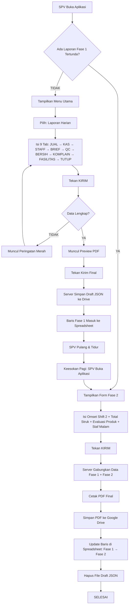
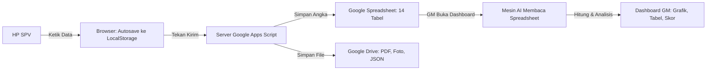
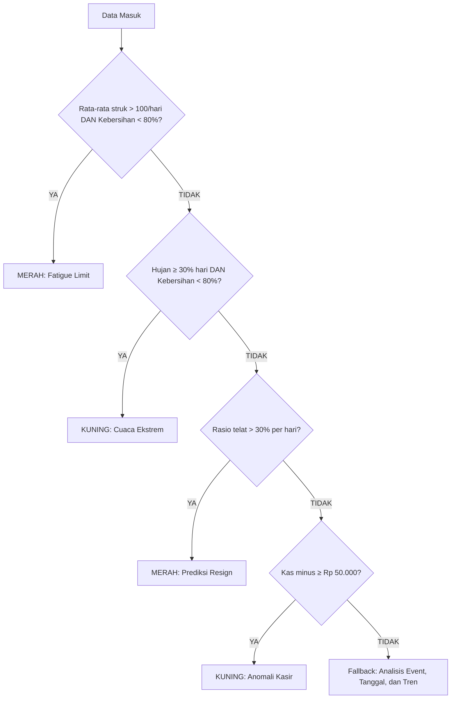

# BAGIAN IV — DI BALIK LAYAR (ARSITEKTUR & FORMULA)

> **Catatan:** Bagian ini bersifat teknis dan ditujukan untuk GM/Owner yang ingin memahami bagaimana angka-angka di Dashboard dihitung, serta bagaimana data disimpan.

---

## BAB 10: MESIN ANALISIS — PARAMETER, THRESHOLD & FORMULA

### 10.1 Skor Operasional (Kotak Utama Tab 1)

**Formula:**
```
Skor = (Pencapaian_Target% × 0.5) + (Skor_Kebersihan% × 0.3) + (Kepatuhan_SOP% × 0.2)
```

| Skor | Label | Warna |
|---|---|---|
| ≥ 85 | EXCELLENT | Hijau |
| 70 – 84 | GOOD | Biru |
| 50 – 69 | ATTENTION | Kuning |
| < 50 | CRITICAL | Merah |

**Penjelasan:** Skor ini menggabungkan 3 pilar utama operasional. Bobot terbesar (50%) ada di pencapaian target omset, karena pada akhirnya kafe harus menghasilkan uang. Kebersihan (30%) di posisi kedua karena langsung mempengaruhi pengalaman pelanggan. Kepatuhan SOP (20%) di posisi terakhir karena bersifat jangka panjang.

### 10.2 Bar Persentase Pencapaian Target

| Persentase | Warna Bar |
|---|---|
| ≥ 100% | Hijau |
| 80% – 99% | Oranye |
| < 80% | Merah |

**Formula:**
```
Persentase = (Total_Omset_Aktual ÷ Target_Omset_Proporsional) × 100%
```

> **"Target Proporsional" — apa artinya?**
> Jika target bulanan Anda Rp 180.000.000 dan bulan ini 30 hari, maka target harian = Rp 6.000.000. Jika Anda memilih rentang 7 hari di dashboard, maka target proporsional = 7 × Rp 6.000.000 = Rp 42.000.000. Ini mencegah perbandingan yang tidak adil.

### 10.3 AI Predictive Summary (4 Algoritma Utama)

Kotak AI Summary di bagian atas Dashboard dihasilkan oleh 4 algoritma yang berjalan berurutan. Jika satu algoritma "menang" (kondisinya terpenuhi), ia akan menimpa algoritma di bawahnya:

#### Algoritma 1: Fatigue Limit (Batas Kelelahan Tim)
| Kondisi | Putusan |
|---|---|
| Rata-rata struk harian > 100 **DAN** Skor Kebersihan < 80% | **MERAH** — "Batas Kelelahan Tim tercapai. Tim butuh bantuan staf Part-Time!" |
| Rata-rata struk harian > 100 **DAN** Komplain > 2× jumlah hari | **KUNING** — "Transaksi tinggi mengorbankan kualitas" |

**Logika:** Jika kafe sangat ramai (>100 struk/hari) tapi kebersihan hancur, artinya staf kelelahan melayani pelanggan dan tidak sempat membersihkan kafe.

#### Algoritma 2: Cuaca × Kebersihan
| Kondisi | Putusan |
|---|---|
| Hari hujan ≥ 30% dari total hari **DAN** Kebersihan < 80% | **KUNING** — "Fasilitas rentan cuaca ekstrem. Terapkan SOP Double-Mopping!" |

**Logika:** Hujan deras menyebabkan lantai basah dan kotor. Jika kebersihan tetap buruk saat hujan, artinya tim tidak punya SOP cuaca buruk.

#### Algoritma 3: Burnout / Prediksi Resign
| Kondisi | Putusan |
|---|---|
| Rentang ≥ 7 hari **DAN** Rasio keterlambatan per hari > 30% | **MERAH** — "Prediksi Churn: Waspada staf resign mendadak" |

**Logika:** Keterlambatan tinggi secara konsisten adalah sinyal demotivasi. Staf yang sering telat berpotensi keluar tanpa peringatan.

#### Algoritma 4: Deteksi Anomali Kasir (Petty Fraud)
| Parameter | Nilai |
|---|---|
| Toleransi selisih kas wajar | Rp 2.000 (di bawah ini diabaikan) |
| Threshold total minus untuk aktifkan analisis | Rp 50.000 |

| Kondisi | Putusan |
|---|---|
| Total selisih minus ≥ Rp 50.000 dalam periode | Sistem menghitung **frekuensi kehadiran** setiap staf pada hari-hari terjadinya minus, lalu menampilkan nama dengan frekuensi tertinggi |

**Logika:** Sistem **TIDAK menuduh** satu orang secara langsung. Ia hanya mengatakan: "Total minus Rp 200.000. Terjadi saat Amel bertugas 26 kali, Eko 17 kali." Keputusan akhir tetap di tangan Anda sebagai owner.

#### Fallback (Jika Tidak Ada Algoritma yang Terpicu)

| Durasi | Kondisi | Putusan |
|---|---|---|
| ≤ 2 hari | Ada Event + Tanggal Tua (15-24) | Kuning: "Trafik padat, daya beli rendah" |
| ≤ 2 hari | Ada Event + Tanggal Muda (25-5) | Hijau: "Momen Emas" |
| 3-14 hari | Omset ≥ target DAN Kebersihan ≥ 90% | Hijau: "Momentum Positif" |
| > 14 hari | Omset ≥ target DAN Kebersihan ≥ 95% DAN Komplain rendah | Hijau: "Golden Era" |
| > 14 hari | Omset < 90% target | Merah: "Kegagalan Target Periode" |

> **Catatan Tanggal:** "Tanggal Muda" artinya dekat dengan tanggal gajian (akhir bulan/awal bulan: tanggal 25-5), sehingga daya beli masyarakat tinggi. "Tanggal Tua" (15-24) artinya uang sudah menipis.

### 10.4 Marketing Intelligence (5 Modul Analisis)

#### Modul C1: Tren Omset

| Perubahan vs Periode Sebelumnya | Status | Warna |
|---|---|---|
| Naik ≥ 5% | Sehat | Hijau |
| Antara -5% sampai +5% | Stagnan | Kuning |
| Turun ≤ -5% | Kritis | Merah |

**Formula:** `Perubahan% = ((Rata-rata_Harian_Periode_Ini - Rata-rata_Harian_Periode_Lalu) ÷ Rata-rata_Harian_Periode_Lalu) × 100%`

#### Modul C2: Analisis Menu (Hero vs Dead)

| Parameter | Nilai |
|---|---|
| Threshold konsistensi | Produk harus muncul di posisi Top/Bottom minimal **40% dari total hari** data |

Momentum produk juga dianalisis:
- **Rising Star:** Produk yang makin sering muncul di Top di paruh kedua periode
- **Fading:** Produk hero yang mulai menurun
- **Worse:** Produk dead yang makin sering muncul
- **Improving:** Produk dead yang mulai membaik

#### Modul C3: Korelasi Kebersihan × Omset

| Kombinasi | Label | Artinya |
|---|---|---|
| Omset ≥ 90% target, Kebersihan < 70% | **The Perfect Storm** | Ramai tapi kotor — sangat berbahaya |
| Omset < 70% target, Kebersihan < 70% | **The Lazy Shift** | Sepi dan kotor — tim malas |
| Omset ≥ 85% target, Kebersihan ≥ 90% | **The Good Standard** | Performa ideal |
| Kebersihan < 80% (umumnya) | **Hygiene di Bawah Standar** | Risiko komplain meningkat |

#### Modul C4: SDM & Risiko Operasional

| Tingkat Keterlambatan | Status | Tindakan |
|---|---|---|
| > 15% | **Krisis** (Merah) | Pertimbangkan SP |
| 5% – 15% | **Warning** (Kuning) | SPV wajib briefing |
| < 5% | **Positif** (Hijau) | Beri apresiasi |

#### Modul C5: Benchmarking ATS

| ATS Aktual vs Benchmark | Status |
|---|---|
| < 80% dari benchmark | **Kritis** — Gagal cross-selling |
| 80% – 99% dari benchmark | **Warning** — Masih di bawah standar |
| ≥ 100% dari benchmark | **Positif** — Upselling berhasil |

**Formula ATS:**
```
Average Ticket Size (ATS) = Total Omset ÷ Total Transaksi (Struk)
```

### 10.5 Area Kritis Kebersihan

| Threshold | Tindakan |
|---|---|
| Rata-rata skor area < 95% | Muncul di daftar "Area Kritis" dengan warna merah |

Sistem menampilkan maksimal 3 area terburuk, diurutkan dari skor terendah.

### 10.6 KPI Komplain

| Total Komplain Sebulan | Label |
|---|---|
| 0 | Aman (Hijau) |
| 1 | Waspada (Kuning) |
| 2 | Batas Maksimal (Oranye) |
| > 2 | **KPI Dilanggar** (Merah) |

### 10.7 KPI Turnover

| Total Resign per Kuartal (3 bulan) | Label |
|---|---|
| 0 | Aman |
| 1 | Batas Maksimal |
| > 1 | **Risiko Kritis** |

### 10.8 Pengaturan GM (Hanya untuk Owner)

| Pengaturan | Lokasi | Fungsi |
|---|---|---|
| **Target Tahunan** | Pengaturan GM di Dashboard | Digunakan untuk menghitung YTD Trajectory |
| **Benchmark ATS** | Di bawah tombol "Simpan & Tarik Analisis" | Default Rp 30.000. Saran: gunakan harga kopi signature + 1 pastry |
| **Folder Google Drive** | Pengaturan GM di Dashboard | Mengubah folder utama penyimpanan file |

---

## BAB 11: ARSITEKTUR DATA — DATABASE & PENYIMPANAN FILE

### 11.1 Daftar Lengkap Tabel Database (Google Sheets)

Seluruh data aplikasi disimpan di dalam satu file Google Spreadsheet yang terdiri dari beberapa lembar (sheet). Berikut daftar lengkapnya:

#### A. Tabel Transaksi Harian

**1. `DB_Laporan_Harian`** — Tabel utama yang menyimpan ringkasan setiap laporan harian.

| No | Nama Kolom | Contoh Isi | Penjelasan |
|----|-----------|-----------|-----------|
| 1 | ID_Laporan | 18-07-2026-Perintis | Kunci unik: Tanggal + Outlet |
| 2 | Tanggal | '18-07-2026 | Tanggal laporan (tanda kutip di depan mencegah korupsi format) |
| 3 | Bulan_Laporan | 07-2026 | Untuk filter cepat per bulan |
| 4 | Outlet | Perintis | Nama outlet |
| 5 | Supervisor | Nathan | Nama SPV yang bertugas |
| 6 | Cuaca | Hujan Gerimis | Cuaca dominan hari itu |
| 7 | Omset_Total | 5800000 | Shift 1 + Shift 2 (angka murni) |
| 8 | Target_Omset | 6000000 | Target harian dari Pengaturan |
| 9 | Total_Transaksi | 95 | Jumlah struk |
| 10 | Kendala_Operasional | "AC mati" | Dari Tab TUTUP |
| 11 | Rekomendasi | "Panggil teknisi" | Dari Tab TUTUP |
| 12 | URL_PDF | (link PDF atau ID Draft JSON) | Fase 1: ID file JSON. Fase 2: URL PDF |
| 13 | Event_Lokal | "UAS Unhas" | Event yang sedang berlangsung |
| 14 | Profil_Pengunjung | Mahasiswa Nugas | Profil dominan |
| 15 | Status_Fase | Fase 1 / Fase 2 | Status pengiriman |

**2. `DB_Briefing_Shift`** — Catatan briefing harian SPV.

| No | Kolom | Penjelasan |
|----|-------|-----------|
| 1 | ID_Laporan | Menghubungkan ke DB_Laporan_Harian |
| 2 | Target_Harian | Target yang disampaikan ke tim |
| 3 | Fokus_Briefing | Instruksi perilaku harian |
| 4 | Kendala_Sebelumnya | Masalah carry-over |
| 5 | Solusi_Eksekusi | Solusi yang disepakati |

**3. `DB_Kehadiran_Staf`** — Rekaman kehadiran dan kepatuhan SOP per staf per hari.

| No | Kolom | Penjelasan |
|----|-------|-----------|
| 1 | ID_Laporan | Menghubungkan ke laporan harian |
| 2 | Nama_Staf | Nama staf |
| 3 | Posisi | Barista / Kasir / Server / Kitchen |
| 4 | Outlet_Tugas | Outlet tempat bertugas hari itu |
| 5 | Outlet_Asal | Outlet asli staf (jika dipinjam) |
| 6 | Status_Kehadiran | Hadir / Terlambat / Izin / Sakit / Alpha |
| 7 | SOP_Keramahan_Miss | YA / TIDAK / N/A (Shift Malam) |
| 8 | Catatan_Kinerja | Keterangan tambahan |

**4. `DB_Audit_Kas`** — Rekaman setiap audit laci kasir.

| No | Kolom | Penjelasan |
|----|-------|-----------|
| 1 | ID_Laporan | Menghubungkan ke laporan harian |
| 2 | Waktu_Audit | Jam audit dilakukan |
| 3 | Kasir_Bertugas | Nama kasir saat itu |
| 4 | Modal_Awal | Uang receh standar (Rp) |
| 5 | Total_QRIS | Uang masuk via QRIS (Rp) |
| 6 | Total_Tunai | Uang fisik di laci (Rp) |
| 7 | Aktual_Sistem | Data dari mesin POS (Rp) |
| 8 | Selisih | Selisih kas (Rp). Minus = masalah |
| 9 | Keterangan | Penjelasan SPV jika ada selisih |

**5. `DB_Kinerja_Produk`** — Data produk terlaris dan paling tidak laku.

| No | Kolom | Penjelasan |
|----|-------|-----------|
| 1 | ID_Laporan | Menghubungkan ke laporan harian/bulanan |
| 2 | Kategori | Minuman / Makanan / Snack |
| 3 | Peringkat | Top / Bottom |
| 4 | Nama_Produk | Nama menu |
| 5 | Qty_Terjual | Jumlah terjual |
| 6 | Keterangan_Promo | Rencana/Action Plan untuk produk Bottom |

**6. `DB_Inspeksi_Operasional`** — Data kebersihan, kerusakan fasilitas, bahan habis pakai, dan QC.

| No | Kolom | Penjelasan |
|----|-------|-----------|
| 1 | ID_Laporan | Menghubungkan ke laporan harian |
| 2 | Tipe_Inspeksi | Kebersihan / Fasilitas / Bahan / QC Espresso / QC Menu |
| 3 | Objek_Dicek | Nama area atau item |
| 4 | Skor_Kondisi | Angka skor (untuk kebersihan) atau status (untuk fasilitas) |
| 5 | Estimasi_Biaya | Untuk bahan: perkiraan harga |
| 6 | Tindakan_Catatan | Catatan atau tanda "[ESKALASI GM]" |
| 7 | URL_Foto_Bukti | Link foto di Google Drive |

#### B. Tabel Evaluasi & Agregasi

**7. `DB_Laporan_Mingguan`** — Ringkasan laporan mingguan.

| No | Kolom | Penjelasan |
|----|-------|-----------|
| 1 | ID_Laporan_Mingguan | Format: TglAwal_to_TglAkhir-Outlet |
| 2 | Periode_Tanggal | "01-07-2026 s/d 07-07-2026" |
| 3 | Outlet | Nama outlet |
| 4 | Supervisor | Nama SPV |
| 5 | Omset_Aktual | Total omset 7 hari |
| 6 | Omset_Target | Total target 7 hari |
| 7 | Komplain_Utama | Ringkasan kendala |
| 8 | URL_PDF | Link PDF laporan di Drive |

**8. `DB_Laporan_Bulanan`** — Ringkasan laporan bulanan (18 kolom).

| No | Kolom | Penjelasan |
|----|-------|-----------|
| 1 | ID_Laporan_Bulanan | Format: YYYY-MM-Outlet |
| 2 | Bulan_Laporan | MM-YYYY |
| 3 | Outlet | Nama outlet |
| 4 | Supervisor | Nama SPV |
| 5 | Omset_Aktual | Total omset sebulan |
| 6 | Omset_Target | Target sebulan |
| 7 | Persen_Tercapai | Persentase pencapaian |
| 8 | Rating_Kerja | Rating diri sendiri (1-10) |
| 9 | Kepatuhan_SOP | Persentase SOP |
| 10 | Total_Telat | Jumlah keterlambatan sebulan |
| 11 | Pencapaian | Pencapaian terbaik SPV |
| 12 | Tantangan | Tantangan tersulit |
| 13 | Total_Pengeluaran_Ekstra | Biaya perbaikan (Rp) |
| 14 | Total_Turnover | Jumlah staf resign |
| 15 | Strategi_Bulan_Depan | Rencana SPV |
| 16 | Kebutuhan_Approval_GM | Permintaan ke owner |
| 17 | URL_PDF | Link PDF laporan |
| 18 | Detail_Resign_JSON | Data staf resign dalam format JSON |

**9. `DB_Evaluasi_Staf`** — Evaluasi individu dari laporan mingguan & bulanan.

| No | Kolom | Penjelasan |
|----|-------|-----------|
| 1 | ID_Laporan_Evaluasi | Menghubungkan ke laporan mingguan/bulanan |
| 2 | Nama_Staf | Nama staf |
| 3 | Posisi | Jabatan |
| 4 | Outlet | Outlet |
| 5 | Status_Evaluasi | Berkembang / Stagnan / Menurun |
| 6 | Catatan_Kinerja | Keterangan dari SPV |

#### C. Tabel Master Data

**10. `Master_Staff`** — Daftar seluruh staf Zero Cafe.

| No | Kolom | Contoh |
|----|-------|--------|
| 1 | ID_Staff | STF-001 |
| 2 | Nama | Nathan |
| 3 | Posisi | Supervisor |
| 4 | Status_Aktif | Aktif / Resign |
| 5 | Outlet_Utama | Perintis |

**11. `Master_Produk`** — Daftar menu kafe.

| No | Kolom | Contoh |
|----|-------|--------|
| 1 | ID_Menu | MNU-001 |
| 2 | Kategori | Minuman |
| 3 | Nama_Menu | Kopi Susu Zero |
| 4 | Harga_Jual | 18000 |
| 5 | Status | Aktif |

#### D. Tabel Konfigurasi

**12. `Config_Parameter`** — Penyimpanan event/kalender akademik.

| No | Kolom | Contoh |
|----|-------|--------|
| 1 | Outlet | Perintis / Semua |
| 2 | Kategori | Kalender Akademik |
| 3 | Nama_Event | UAS Unhas |
| 4 | Tanggal_Mulai | 2026-07-01 |
| 5 | Tanggal_Selesai | 2026-07-14 |
| 6 | Status | Aktif |

**13. `Config_Target`** — Target omset bulanan per outlet.

| No | Kolom | Contoh |
|----|-------|--------|
| 1 | Bulan_Tahun | 07-2026 |
| 2 | (Reserved) | — |
| 3 | Outlet | Perintis |
| 4 | Target_Omset | 180000000 |

**14. `Database_GM_Cache`** — Cache data yang diproses setiap malam untuk mempercepat Dashboard GM.

### 11.2 Arsitektur Folder Google Drive

Semua file (PDF Laporan, PDF Checklist Kebersihan, Foto Fasilitas, Foto Nota) disimpan di Google Drive dengan struktur folder berikut:

```
📁 Zero Cafe Workspace Drive (Root Folder)
 └── 📁 2026 (Tahun)
      └── 📁 Juli (Bulan)
           └── 📁 Perintis (Outlet)
                ├── 📁 Daily Reports
                │    ├── 18-07-2026-laporan-harian.pdf
                │    └── 18-07-2026-draft-Perintis.json (sementara, dihapus setelah Fase 2)
                ├── 📁 Laporan Mingguan
                │    └── 1-7-juli-laporan mingguan.pdf
                ├── 📁 Laporan Bulanan
                │    └── Juli-laporan-bulanan.pdf
                ├── 📁 Checklist Kebersihan
                │    └── 18-07-2026-checklistbox-Perintis.pdf
                ├── 📁 Fasilitas
                │    └── 18-07-ACLantai1-RusakBerat.jpg
                └── 📁 Pengeluaran
                     └── 18-07-SabunCuci-Habis.jpg
           └── 📁 Dg_Tata (Outlet)
                ├── 📁 Daily Reports
                ├── 📁 Laporan Mingguan
                ├── ...dst
```

### 11.3 Format Penamaan File

| Jenis File | Format Nama | Contoh |
|---|---|---|
| Laporan Harian (PDF) | `DD-MM-YYYY-laporan-harian.pdf` | `18-07-2026-laporan-harian.pdf` |
| Draft Fase 1 (JSON) | `DD-MM-YYYY-draft-Outlet.json` | `18-07-2026-draft-Perintis.json` |
| Laporan Mingguan | `TglAwal-TglAkhir-bulan-laporan mingguan.pdf` | `1-7-juli-laporan mingguan.pdf` |
| Laporan Bulanan | `Bulan-laporan-bulanan.pdf` | `Juli-laporan-bulanan.pdf` |
| Checklist Kebersihan | `DD-MM-YYYY-checklistbox-Outlet.pdf` | `18-07-2026-checklistbox-Perintis.pdf` |
| Foto Fasilitas/Bahan | `DD-MM-NamaItem-Status.jpg` | `18-07-ACLantai1-RusakBerat.jpg` |

### 11.4 Perlindungan Format Tanggal (The Apostrophe Rule)

Google Sheets memiliki kebiasaan buruk: ia sering mengubah tanggal `10-08-2026` (10 Agustus) menjadi `8 Oktober 2026` karena menganggap angka "10" adalah bulan (format Amerika).

**Solusi sistem:** Setiap kali menyimpan tanggal ke Spreadsheet, sistem menyisipkan tanda kutip tunggal (`'`) di depan teks tanggal. Contoh: `'18-07-2026`. Ini memaksa Google Sheets menerima data sebagai teks murni, bukan tanggal yang bisa dimanipulasi.

### 11.5 Sanitasi Data (Pembersihan Otomatis)

Sebelum data disimpan ke Spreadsheet, sistem membersihkan:
- **Angka uang:** Menghapus "Rp", titik, dan spasi → hanya menyisakan angka murni
- **Tanggal:** Mendeteksi dan mengkonversi otomatis antara format `DD-MM-YYYY` dan `YYYY-MM-DD`
- **Teks:** Menghapus spasi berlebih di awal dan akhir teks
- **Kolom numerik kosong:** Diisi angka `0` (bukan teks kosong)

---

## BAB 12: DIAGRAM ALUR KERJA (VISUAL)

### 12.1 Alur Kerja Harian SPV



### 12.2 Alur Data: Dari HP SPV ke Dashboard GM



### 12.3 Pohon Keputusan AI Summary



---

## BAB 13: SISTEM KEAMANAN & PERLINDUNGAN DATA

### 13.1 Anti Double-Submit (Race-Condition Lock)

Setelah SPV menekan tombol "Kirim", sistem mengunci pengiriman selama **10 detik**. Jika SPV menekan lagi dalam 10 detik, muncul pesan: "Pengiriman terlalu cepat (Spam klik). Laporan sedang diproses."

### 13.2 Anti Duplikasi Laporan

Sebelum menyimpan laporan baru, sistem memeriksa apakah sudah ada laporan dengan ID yang sama di database. Jika ada, laporan ditolak: "Laporan untuk periode ini sudah ada. Pengiriman ganda digagalkan!"

### 13.3 Anti Kontaminasi Silang Draft

Jika SPV login di outlet A, namun browser masih menyimpan draft dari outlet B (misalnya karena kemarin pinjam HP), sistem otomatis membuang draft yang tidak cocok. Data outlet lain tidak akan pernah tercampur.

### 13.4 Self-Healing: Penanganan Data Hilang

Jika file Draft JSON (Fase 1) hilang dari Google Drive (misalnya karena terhapus manual), sistem akan:
1. Mendeteksi bahwa draft tidak ditemukan
2. Otomatis menghapus baris "menggantung" di Spreadsheet
3. Memberitahu SPV: "Data Fase 1 tidak ditemukan. Sistem telah menghapus status gantung Anda. Silakan buat ulang laporan."

### 13.5 Perlindungan Form: Tidak Ada Reset Prematur

Sistem **TIDAK** akan menghapus data yang sudah diketik SPV sebelum server memastikan laporan berhasil tersimpan. Jika koneksi terputus, semua data tetap aman di layar — SPV tinggal tekan "Kirim" lagi.

### 13.6 Timezone-Safe Date Parsing

Semua pemrosesan tanggal di server menggunakan metode pemotongan teks (string split), **bukan** konversi objek tanggal (Date object). Ini mencegah bug di mana server Google (yang beroperasi di zona waktu UTC) menggeser tanggal mundur 1 hari.

Contoh: Tanggal "1 Desember 2026" yang dikirim dari HP di Makassar (WITA, UTC+8) bisa berubah menjadi "30 November 2026" jika diproses sebagai objek Date di server UTC. Dengan metode pemotongan teks, hal ini **tidak akan pernah terjadi**.

---

